# 复旦大学专业填报指南

Hi各位26届的学弟学妹们! 这里是身处期末周精神状态良好的大学老人。想必大家最近为了志愿填报焦头烂额。不要急，我们会尽力为大家提供一手的就读体验与专业信息。此文档会一直更新到报志愿的那天。

⚠️叠甲: 学长学姐也免不了主观色彩，大家理性看待，尽可能多地掌握客观信息。

## 写在专业填报前：

正如高考前和很多同学说的那样，“高考只是人生中一个必然到来的节点，并不对你的人生构成致命的转折”。专业填报某种意义上也是。我们必然无法在填报前了解所有信息，“热爱”与否往往也是后验的东西。所以，秉持着对自己负责的态度，好好咨询了解，well-informed的前提下，不妨就遵循自己的直觉，实在不行就排除法后掷个骰子吧（当然，不要在领军/非领军班之间乱掷）。你的人生不由一次选择决定。即使进来后发现报错专业，\*仍然可以在来年春天选择转专业；更进一步说，日后的职业和专业的相关性也不一定有那么大（强科研导向的另说）。所以，保持探索，保持积极乐观的态度。相信大家会度过充实而丰富的大学四年、七年、八年，或者更多（）。

本文档建设者包括来自上海交通大学附属中学录取复旦的毕业生，也包括来自五湖四海的、愿意为学弟学妹们做些事情的复旦人。让我们感谢他们在期末季抽出时间来写下这些文字。

希望受益于本文档的同学们明年此时也能做相同的事情。代代相传，促进信息的流通与公平。

——来自上海交通大学附属中学2507 复旦大学经济学院 本文档编者 赵思源

## 零、一些通用信息:

### fdurop科研项目:fdurop

### 院系环游

复旦大学学生会公众号内搜索“院系环游”，有各专业的较为官方的介绍

这里以经济学院为例: 经济学院官方介绍

## 物化组

### 智能材料与未来能源

#### 领军班/非领军班

首先，关于领军与非领军。事实上，在呆了一年后，我会说，这俩的差别只有是否能直博的差别，在其他资源上，我没有看到太多倾斜。

我们的班型分为三种：领军人才班（直博班）、产教融合班（保研班，专硕）、普通班。首先，领军人才班的直博需要实现绩点大于3.3、承担一项复芏计划（为期一年的科研项目实践）的条件，这是两项不算困难的条件，在进入领军班后只要你有读博意愿几乎可以说是能铁直博的。然后，存在动态进出机制，即结合绩点、科研等方面的考察，从普通班中选取优秀同学进入直博班、保研班。

就像开头说的那样，领军班除了直博这一项以外，没有其他太多资源倾斜。不过毕竟直博在一定程度上增大了未来的确定性，从某些方面来说，我认为能以一种更轻松的心态感受本科生活，以及能更早进组做一些相关工作。

#### 专业细分方向/就业前景

然后是专业方面，先从学院的方向说起吧。我们院叫智能材料与未来能源创新学院，从名称上就可以看出，老师们的研究方向可以不严肃地分为两块，一个是偏物理、偏半导体器件的“智能材料”，另一个是偏化学、偏电池新能源的“未来能源”。在专业上体现为，我们这一届有偏物理的电子科学与技术、材料物理，和偏化学的能源化学、高分子化学（不记得是不是叫这名了）、材料化学；26届的具体信息我不太了解，只知道招生专业分为电子科学与技术、材料科学与工程、新能源科学与工程这三个【编者注: 因省市而异，上海考生请看26年复旦上海招生计划】，和我们这一届对比，我猜测材料科学与工程对应的是偏物理的材料物理，新能源科学与工程对应的是偏化学的三位。

具体地说，电子科学与技术与材料物理具有相似性，这俩对口的半导体材料之类的，就业的话包括华为、中芯等等。本科期间的课程是材料领域的专业课（如材料分析、材料表征等等），加一些物理系课程的青春mini版。化学方向的专业课程也是材料领域的专业课，加上化学系高分子系的一些青春mini版。对口方向包括新能源电池、氢能、催化等领域，就业有比亚迪、宁德等等。

客观来讲，我觉得复旦的材料系不差的。它的研究方向如上所述，不是传统的材料研究，而是聚焦于新材料新能源。选择好的组，在就业上其实不会特别困难，当然薪资的下限和上限肯定都低于带电的那几位新工科。

#### 保研率/卷度

保研率的话其实也就是30％左右的经典保研率，材料系的整体氛围没有特别卷，所以努努力保研还是能拿到的。

### 未来信息创新学院

#### 领军/非领军

领军班是本博贯通的，八年制还是多少年制我不知道，目前也没有一个很硬性的淘汰规定。但是信院有个光子计划，二次选拔的，要求是绩点大于等于3.4加一项fdurop计划

关于光子计划:

<https://mp.weixin.qq.com/s/fggu_U0MH98F4-Kgg0_VOw>

#### 分流与保研

1

#### 就业与科研

就业科研的话，就业的话硬件软件都有，看自己选择了。信院科研方向的话，有AI 有软件的 有硬件的（嵌入式什么的）也有光的 材料的。去向要么去大厂比如华为、中芯研发岗，要么就是去一些国企的科研单位，科研所这些。

#### 学习内容与建议

大一进来之后学的应该是数分B。数分B的话，难度和高数A齐平【编者注: 如果选谢xl老师的数学分析那另当别论，参考问答区第三条，选课自由】，反正就做好往难里学的准备吧。然后大学物理学的是大物B。暑假有机会的话，先自学一下C语言，这个开学是要用得到的。这个专业需要动手能力和实践能力强一点，然后学起来也比较累，自己需要耐得住性子一点。

#### 电子信息科学与技术

**1.电子信息学什么？**

核心能力：信息处理 + 电路设计 + 信息系统的融合

硬件方面学电路基础、数字逻辑、电磁与物理、系统级硬件(设计与搭建）等。软件方面学编程基础（C语言、verilog / VHDL）、信号处理方法、人工智能与数据、系统级软件（软硬结合，比如PID控制）等。

**2.就业方向？就业前景**

**对口岗位：**

（1）信号处理与算法类：数字信号处理工程师，嵌入式软件工程师，算法工程师（AI方向）

（2）集成电路类：数字IC设计工程师，模拟IC设计工程师，FPGA工程师。嵌入式硬件工程师

（3）通信与网络：通信系统工程师，射频工程师

**就业单位：**

国央企，比如：中国航天科技/科工集团，中国电子科技集团（CETC），中国航空工业集团，中国船舶集团，移动，联通，电信

民营大厂，比如：华为、中兴、比亚迪、理想

外企/中外合资，比如：德州仪器（TI），英伟达，英特尔

考公

**3.专业优势**

**（1）培养定位**：软硬兼修的”全链路“工程师。既懂算法又懂电路，能打通从信号到系统的全链路。用硬件实现信号处理，用软件控制硬件系统。

**（2）“光子计划”院士班**：10位院士组成指导团队，每位院士每年仅带不超过3名学生。院士“亲自遴选、亲自选题、亲自指导、亲自规划”，大一进入院士团队，**本博贯通。**交大电院虽然也有荣誉计划，但院士直接指导本科生的密度和深度，复旦目前更胜一筹。

**（3）学院的方向优势**：聚焦国家战略前沿。AI + 电子信息的智能融合，6G通信，量子科技，光电科技，空天信息网络等为重点建设方向。

**（4）平台优势**：复旦大学综合大学的交叉生态。六大创新学院融合，学生可以跨越传统学科边界，在电子信息与AI、新材料、生物医学等交叉领域开展研究；可以选修任意学科的课，参与跨学科的科研项目。

**（5）发展优势**：新学院的红利。会有资源倾斜，比如经费支持、优先配置院士资源、优先建实验室和平台；没有历史包袱，课程体系全新设计、灵活调整。

**（6）制度设计**：专业确定，方向灵活。具体来说，填志愿时就已经选定"电子信息科学与技术"这个专业，入学后不会再参加任何专业分流，彻底避免了"进试验班后被分流到不想去的专业"那种焦虑。像上海交大，虽然2025年改革后把原来的"信息类"大类拆成了几个小类，但本质上还是大类招生，学生大一结束后仍需面临专业分流，要按成绩排名竞争热门方向，存在不小的不确定性。但这并不意味着被框死了。恰恰相反，我们在专业确定的前提下保留了很大的方向弹性——你想更偏AI，还是更偏电子电路、智能系统、光电、空天信息，这些都可以通过进阶课程的自由选择来实现。特别是X修读体系里的进阶模块二，是完全自选的，你对哪个方向感兴趣就可以多选那个方向的课，相当于在同一个专业框架内定制自己的发展路径。总结起来就是：既避免了"进试验班被分流"的焦虑，又保留了"深耕感兴趣方向"的弹性。专业定而不死，方向活而不散。

**4.就读体验**

本科这几年，我最大的感受就是机会真的很多。不管将来想往哪个方向发展，这里基本都能找到对应的资源和平台。

**想搞科研：**一方面学校有"曦源计划""登辉计划"这些专门的本科生科研项目，申请下来就能正经做课题；另一方面，如果你已经有感兴趣的方向，完全可以直接去找老师，发邮件或者课后去办公室聊，很多老师都很欢迎本科生进组跟着做东西，哪怕什么都不会，从头学起也行，氛围还是挺开放的。

**喜欢打竞赛**：学院和学校也会给支持。比如每年大学生数学竞赛，学校会专门开辅导课；再比如我们学院很多同学都会参加的全国大学生电子设计竞赛，这个真的值得一说——学院会请资历特别深的教授来给我们上课，会讲理论，也会带着动手做。最后正式比赛的时候是三个人一组，关在一起四天三夜，做完一道完整的题目，过程特别累，但做出来的那一刻真的爽，而且这段经历本身也很有意思，能学到特别多课堂上学不到的东西。

**对社会实践感兴趣**：学院每年也有基层实习的机会，大二年级就有去云南支教的项目，是可以报名申请的，想参加的话关注通知就行。

**再说说专业课**。如果不考虑绩点压力的话，其实蛮有意思的。除了大一上，之后基本每学期都有实验课，而且不是那种走个过场的实验，是真的要你搭电路、写代码、调系统。每次实验做出来、系统终于达到预期效果的时候，很有成就感。以大一的电子系统导论为例，这门课会教你从零开始搭一个小车，然后学会怎么控制它。最后的考核不是笔试，是现场操作——让你的小车自动巡线运动，要完成避障和"8"字绕圈。我们那一年考的就是这个，后来听学弟学妹说还增加了色块避障的任务。但说实话，当你亲手搭建小车系统、写完控制程序，看着小车在自己跑道上稳稳地跑起来、绕过障碍物的时候，真的会觉得，嗯，这专业选得还挺值的。

### 数学科学学院，

实际上，数院的认可度、学科排名之类的不用太多介绍，想报数学的自然清楚复旦多么合适，没兴趣不理解的那也不适合数院。（你真的心里纠结的话，笔者个人觉得交大附中有报考数学想法的考生都不会跟不上，只要有学数学的想法就可以无脑冲）

所以就简单地介绍下今年的招生计划，给想报数学的考生心里一个底

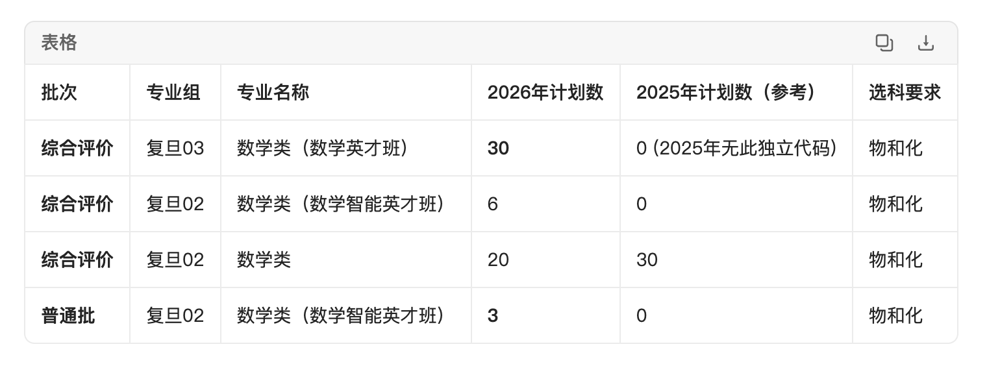

#### 英才班/普通班

这个和交中  致远英才班 的 英才 名字是一样的（雾）

招生上，数学英才班是存在了很久的，数学智能英才班是今年新开的，两者在理解上可以直接画等号。具体地，数院分 数学与应用数学 ＆ 信息与计算科学 这两个专业，之前英才班强制分流前者。所以根据推测这个数学智能英才班应该是针对后者开设的，最后大概是强制分流信息与计算科学这个专业。不过两个专业在培养方案上差别并不明显，保研也是大锅粥一起的，这一点上不用太纠结。

还有就是普通班和英才班的区别：个人感觉英才班的课还是比较合理的，会比普通班进度快一点，并且英才班内部还可以根据选课进一步细分快节奏与慢节奏的班，所以不用担心跟不上。＆ 压力和成长收获总是成正比的，英才班是给了你一个平台让你想怎么卷怎么卷，当然你也可以不卷（当然普通班其实也一样）。英才班专设的所有课程都不限 A 类，我不清楚学校里有没有第二个专业有这个特权。

话说回来英才班和普通班真的没什么大区别，无非是数分这课英才班两学期，普通版三学期，大学物理这种英才班不用上，改成了经典数学思想。这么点差异笔者认为可以忽略，专业上的差异远小于个体的差异。

所以省流版就是，**哪个好进报哪个****。**至于分数线上的博弈，和去年相比是扩招的，其他的笔者也不了解，大家自己判断了

### 4.管理学院

重要提醒: 经济管理试验班属于管理学院，要求物化双选。经济学类属于经济学院，不限组可填报。

#### 卓研博英班/非卓博班

重要提醒：“卓博班与非卓博班“与其他工科院系的领军/非领军班有较大差异

卓研博英班（官方邮件叙述）：

”根据学校整体发展要求、国家人才培养需求和学院学科建设规划，管理学院对现有本科培养方案进行了优化调整，从2025年开始新增“卓研博英班”**本博贯通**项目，旨在为优秀学生提供更高质量的教育资源和个性化培养路径，聚焦“以攻读博士为目标”的**科研型学术**人才培养。“

面向全校招生，估计招收30位学生。

所以重点在于卓博班并不是一个官方公开承诺100%保研的班型（虽然传闻100%，此处存疑，但可确定保研率很高，至少75%），同时并不是一个本研贯通，而是**本博贯通**的班型。以及方向是**学术科研**，与其他工科院系领军班（可能是专硕与就业导向）并不一样。

根据我认识的23级卓博班同学的说法，如果选择读研，需要和普通班同学一起竞争保研名额（所以略有吃亏，因为课程较难）；如果选择读博，则是卓博班的渠道（保研率极高）

卓博班可分流的方向：所有方向！

卓博班可以随时退出，但是选择专业方向比其他同学早一些（其他同学最晚大三下，卓博同学最晚大二下），在大三开始卓博班的同学就可以学习研究生阶段的课程了（不过本科生课程都需要修读）

卓博班在**上海市高考录取（任何批次）中均无法直接选入**，必须入校后进行校内报名与选拔

但是25届存在特殊情况，有两名同学直接进入卓研博英班（福建1吉林1）

（非卓博班）普通班：

完全没有任何不好的意思（笔者也是，原因就是不想走学术），实际上也是大部分人的归属。

#### 分流与保研

**完全自由****分流****，**共七个系，学位配置：2理1工4管

*统计学**/管理科学(**理学学位**)*

*信息管理（工学学位）*

*财务管理/会计学/工商管理/市场营销（管理学学位）*

*（管理科学就是理学，不要再乱改了）*

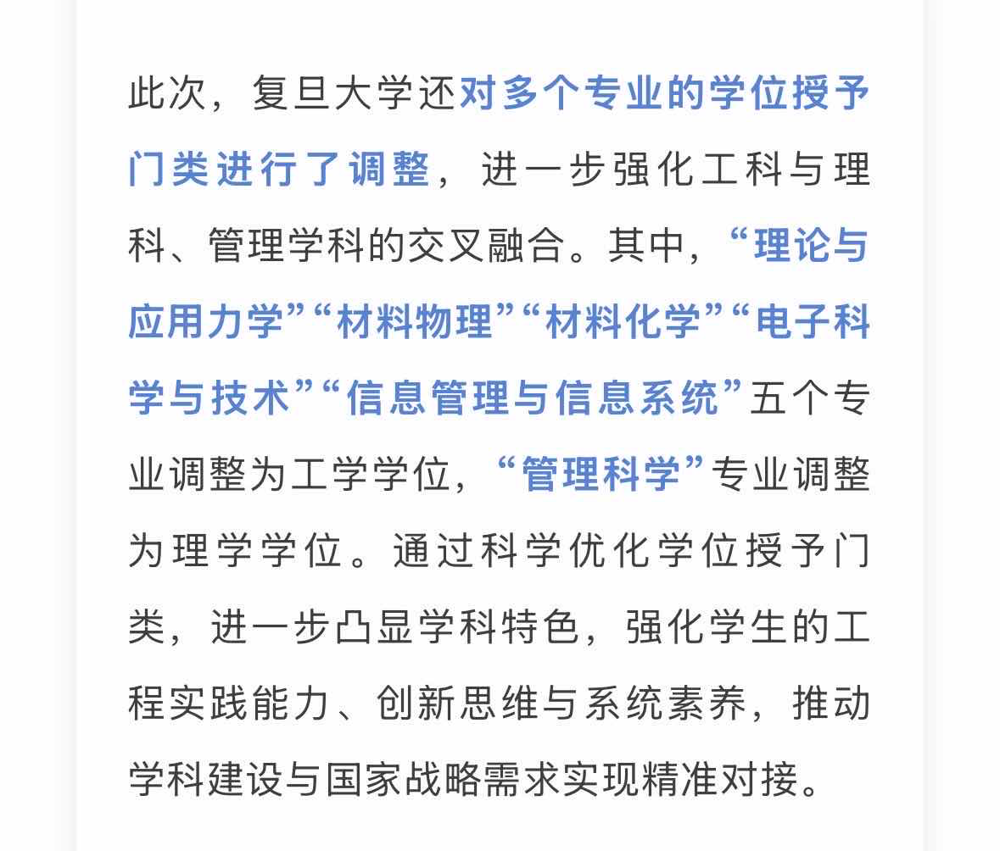

保研率是招生时鼓吹的一大优势，事实上也大差不差，在没有刻意扩招”保研班“的情况下，至少也能保证30%左右的人数（并非前30%，而是全年级30%的人数）保研。大部分时候管院会将保研率与升学率进行对等（境内保研+境外升学），大概能达到40%+，在前几年海外申请较好的时候，甚至排名前50%就可以获得保研资格（因为头部学生选择申海外，放弃保研）

#### 课程概览

不同系在学习课程上有所不同，但是大一第一学期课程是一致的，需要学习数学分析AI、线性代数、Python等课程，对数学要求较高，虽然难度远弱于其他工科院系，但难度依然很高。（当然了，难度很高并不代表拿不了满绩（A），实际上会有同行衬托的，例如本人期中考试复习了一天结果分数比A线高出10分）

课程比较杂，管理学、经济学、数学等都是必须要上的，确实比较泛，且很难同期与计院等科班出身的同学去竞争一些计算机/算法/程设的比赛。

#### 就业与实习

总体来看就业质量不错，本科/硕士就业率很高

就业与实习的领域范围**极广，**涵盖算法、量化、投行、行研、ai产品、运营、咨询、审计、快消等等行业

具体情况可微信和网络上搜索25年的就业情况，官方已披露本科/硕士各项目的就业状况与具体雇主公司名

#### 出国

总体来说几乎每一位同学都会有半年时间出国游学（以前是学院出很大一部分钱，现在未知），卓博班的同学应该有一年时间出国交流（不过最早的卓博班是23级，所以具体时间未知）

#### 奖学金

管院奖学金极其丰富，除了学校统一的奖学金之外还有管院独有的大朴奖学金、何亚东文体奖学金、宽远博学营项目、兴泉一带一路留学生奖学金、亚美超越奖学金、永康奖学金、郑祖康基金奖学金、兴青年奖学金、薛华成奖学金、张文贤奖学金、筑梦未来奖学金、非同凡响奖学金（无论是在文体、社团、科研、竞赛任何一个方面非常突出都有奖学金的支持，管理学院是最不功利的学院之一，鼓励学生随心自由发展，因为管院有钱bushi）【编者注：管院确实很有钱。在经院办公楼尚为老破大的时候他们就已经享用上了单人包间自习室。】

#### 其他

复旦管院给每个学生（非卓博）都配备一位业界的高管作为校友导师，在管院人脉相当丰富了

### 金融科技（国际金融学院）

也和管院一样是商科专业。金融科技主要是把科技手段用到金融里，就业方向包括量化（用计算机做交易）、传统金融等。课程设置上，金融类课程占比更大，科技类相对辅助。

本专业分两个方向：量化科技和金融实务。

一些亮点：

- 全英文授课：专业课全英文，学完知识后不用再“中译英”一遍，可以直接用英文思维去理解金融概念。国际生占比也很高，甚至2025级超过了一半。
- 课程内容：包括金融核心课（微观经济学、投资学、公司金融等），也有Python、区块链、AI在金融中的应用等科技课。科技类课程的深度不如计算机/大数据专业，但比纯金融专业多了一些数据分析训练。
- 职业发展中心：提供一对一职业咨询、简历指导、模拟面试、企业导师对接；暑期实习是必修环节，由中心统一安排对接。因为学院每一届人数很少（金融科技本科2023年才首次招生），所以职业发展中心平均到每个同学身上的精力会比较多。
- 海外交流：学院与哥伦比亚大学、威斯敏斯特大学、新加坡管理大学等有双学位或交换协议。
- 就业去向：传统金融（投行、券商、银行）、量化（量化私募、公募量化、衍生品）、金融科技企业、政府金融监管部门或国际组织。不过这些是研究生的就业去向，本学院本科还没有产生毕业生（你们是第四届）。
- 由于位列物化组，被诸如微电子、大数据等理工科专业竞争导致分数线不是特别高（往年位列不限组的时候分数线是很高的）；并且现在中国的经济处于周期低谷，金融相对不是很热门，报考此专业相当于低位买入（个人观点仅供参考（））

几个常见问题：

- 量化对传统金融知识有要求吗？

有一定要求，模型策略需要结合金融业务逻辑，纯粹懂代码可能不够。

- 量化对数学天赋要求高吗？

不同方向要求不同，有的偏统计分析，有的偏AI建模。现在编程语法可以借助AI辅助，但数理逻辑和判断能力可能也仍然有一定用处。

- 这些技能能不能自己学？

可以，本科阶段内容本身不深，很多知识和工具都可以通过自学或实习补充。选专业不是就业的唯一因素，后续实习和项目经历，以及自学的知识和面试等等也有一定影响。

最后，建议根据自己兴趣和分数情况决定。

### 智能机器人与先进制造学院

【编者注：今年具身智能似乎分开招生了，让我们等候具体政策。】

首先我们学院因为叫智能机器人与先进制造创新学院，它主要分两个大方向：

1. 机器人方向

- 智能制造方向

我们学院目前包含三大分支：机器人、智能制造和航空航天。

#### 5.1 智能制造

主要分为光学、微纳制造和理论与应用力学。

1）微纳制造：主要是去做一些纳米机器人，包括很多芯片的工艺方面，比如说刻蚀啊，包括集成电路的很多工艺，也有做封装的。光学和这个微纳制造都有做封装以及刻蚀。

2）智能光电：主要是处理一些光信号，可还有光传感器，以及光纤也有涉及，然后就是光本身的分析，可能光谱这样的所有涉及到光有关的，都在这里面。我们现在拥有超越照明研究所。

但是设计和FPGA这两个方向，就是我们学院是没有太多的，主要是在集成电路和微纳电子学院微电子那边

#### 5.2 智能机器人

主要分为两个方向：

a. 硬件方向：未来机器人

b. 软件方向：具身智能，以及今年刚成立的通用物理智能

因为复旦的工科起步比较晚，所以它的基础相对比较薄弱，但不代表水平不高。

相比于浙江大学、清华大学、上海交通大学等工科传统强校，我们在机械和控制（即自动化、控制等偏硬件机械部分的专业）方面可能不是很强势。因为本科没有专门设置这些专业，我们没有自动化专业，只有研究生院收了少量交叉学科。

我们更偏向于交叉方向，以及上层算法、仿真、控制、智能交互和机器人方向。苏昊教授【编者注：最近投资界炙手可热的Hillbots便是苏教授领衔的】来了之后，新成立的通用物理智能研究院，会极大幅度地提高复旦在机器人、具身智能领域的专业排名。他主要负责仿真理论、仿真平台架构以及真实世界交互。

机器人领域目前有三大院，分别由三位领军人物带领：

**通用物理智能研究院：**由苏昊教授带领，是2026年4月刚揭牌成立的新兴研究院。

**可信****具身****智能研究院：**由姜育刚校长带领，是去年筹备成立的新院所。

**智能机器人研究院：**由甘中学院长带领。

三位院长分别负责三个不同方向：

1. 智能机器人研究院：负责机器人本体架构。

2. 可信具身智能研究院：负责上层算法架构。

3. 通用物理智能研究院：负责与真实物理世界的交互。

#### 5.3 航空与航天

这一方面主要分为两个分支：

1. 飞行器设计与制造：设计一些飞行器、无人机，可能跟大疆，时的科技（低空经济领头羊）深度合作。

1. 理论智能空天：偏理论方面的一些内容，比如流体力学、飞行动力学等

**总结**：该学院本科目前来说是有六个分支：

1. **智能机器人**的未来机器人和具身智能。

2. **先进制造**的微纳制造和智能光电。

1. **航空宇航**的智能空天和数智力学

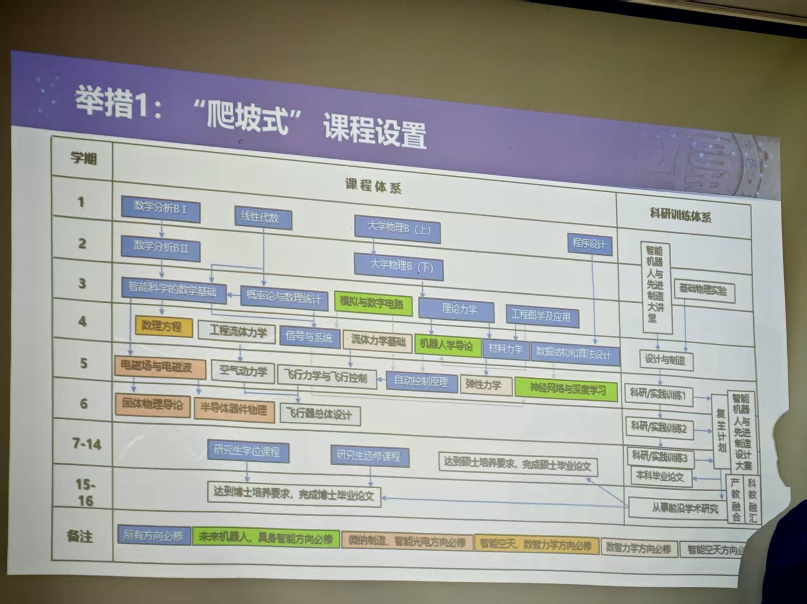

#### 5.4 领军人才计划和普通班

领军人才计划和普通班其实跟其他的学长学姐跟告诉你的一样，没有实质上的资源差别，但确实有保研的分别：

**1. 领军人才计划：**

a. 可以直通本博贯通

b. 政策比较好：在硕士阶段，如果不能读下去博士，退出的话可以给硕士学位

c. 直博政策优势：不像其他直博政策，博士读不下去想退出拿不到硕士学位证，领军人才计划在学士学位证之后，若完成硕士阶段学习任务，硕士结束后退出不继续直博可拿硕士学位

**2. 普通班：**

保研压力较大，因为整体领军班的保研名额占学院总体保研名额，拿掉这部分名额后，普通班保研率约为30%

动态进出政策和其余学院一样

如果你能进入到领军计划的话，我觉得它有一个好处就是它没有绩点压力。我们只要保证一次复芏计划（曦源保底，最好是望道和莙政），然后整体绩点高于3.3，你就可以正常的保博，只不过是你的导师有“好”有“坏”而已，就是你一定能读，往下读博士、硕士。

所以，领军相比于普通班的一个非常好的好处，就是你不用去卷绩点，就只瞅着那个绩点去活，你可以在本科阶段体会到很多不一样的事情，去做你真正想做的事情。

### 生物医学工程与技术创新学院

#### 学习内容与后续方向

大家不要被名称欺骗啊，其实学习的内容更注重“工程”，而非“生物”【编者注：想学生物就去生科院，后续分流选生物科学/生物技术方向；真很想做生医工也可以考虑医学类专业】【另一位生医工同学注：生医工这个专业在专业书里面是分属工科电类的】，其实学习的内容和集成电路比较类似。大一阶段和其他的工科专业都差不多，就是学高等数学A（但如果是领军班的话，我们今年的领军班学习的课程是“高等微积分”，其实也就是数学分析）、线性代数、大学物理B、Python、电路基础等等。后面进阶的方向选择，主要包括三个方向：医学影像与人工智能、生物医学传感技术与芯片、生物医学数据学方向。可以说我们专业学的东西是比较多，也比较杂的。

#### 就业去向

关于毕业去向，由于本人也是刚刚读完一年的新生，所以也没有特别了解，摘取一段来自报考指南的话：生物医学工程专业的学生毕业后大部分进入包括复旦大学在内的国内外知名高等学校和重点研究院所攻读硕士、博士学位。直接就业的学生主要进入高端医疗器械企业、人工智能与医疗科技公司、半导体行业、信息技术领域、三甲医院医工交叉部门、医疗器械监管机构、各级高等学校及科研院所等，从事教学科研、技术研发、临床应用、监督管理等工作。

#### 科研体验

我们25级的这届有一个学术体验学术轮转活动，目前还在第一轮。是一个我们学生写意向和个人情况说明，导师和学生双向选择的过程。这个活动让我们能够更早地去各种方向的实验室体验，在这一层互选之后，相当于就是直接和导师对接了。比如说我当时是和一位脑机接口方向的导师双向选择了，我们直接在邮件和微信上联系，寒假去张江校区待了一个星期，了解了一些脑机接口的基本知识，也亲自上手给师姐帮忙解除了最基本常见的脑机接口的工作。大一下学期也在导师的带领下参加了生医工竞赛。个人感觉收获良多，但是也更加让我对硬件方向产生了兴趣（笑哭）。当然，完全不需要把它当作一个负担！我们可以自主选择是否参加，也可以自主选择在什么程度上参加。据我所知，我身边的同学们，可以完全把精力投注到大一本身的学业上，也可以很多地很深入地参与到导师的实验室中！导师们并不会因为我们是大一的什么都不会就不管我们，反而会非常鼓励我们在实践中学习、在实践中探寻方向！个人认为是一个很好地活动，只是目前来看有可能被院系层面遗忘了轮转这一步。

#### 学生工作

笔者自己在生医工学生会混迹了一年，大二会继续待在学生会。生医工作为一个新兴学院，在学生工作上面非常开明，秉持着非常欢迎新鲜血液、非常鼓励有能力者有意向者来加入，不怎么关注你是否是“老资历”！。笔者大一在学生会的时候，确确实实能感觉到大家正在努力把学生会做大做强，学长学姐们都很有耐心很通情达理，老师也很信任我们学生自己的力量能力，真正很快乐地在工作，大家都很有凝聚力！明年我们学生会会接管更多的生医工事务和活动，欢迎大家的加入！

### 集成电路与微纳电子创新学院

<https://mp.weixin.qq.com/s/ltNs0LW6pLprEPcE20sSzQ>←一篇微电子专业同学们的访谈，建议想报此专业的同学们阅读

分流微电子前必读 ←前人之见

#### 学习内容和专业介绍

想了解ic（集成电路）方向的可以看这个网站：IC自学指南，内容很全面。

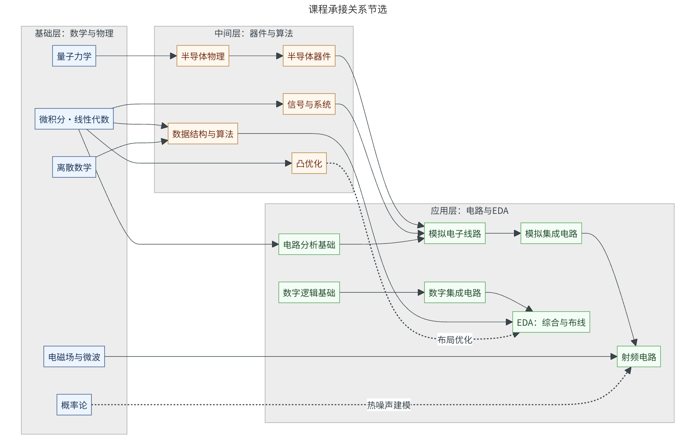

本人其实上了半年才知道集成电路是什么东西，其实没啥影响因为这个专业科研什么的起步比较晚（专业课上完得大三下似乎），不像cs，ai这些科研开始的很早（当然如果你要出国需要刷科研经历那你必须很早开始科研，可以去参加物理系、cs等等的组，但这就是另一回事了）。当然还是建议大家一定要了解好专业再做选择。

#### 领军班/非领军班

领军班和普通班各个学院应该是差不多的。【编者注：但是*#你们微电子真逆天*】【其他写者注：*#你们微电子真逆天*】（按照目前的培养方案，领军班是保研加直博，可以随时自愿退出，比如读不动博士了可以硕士毕业，但是这个政策说不好三四年以后会变成什么样）

#### 建议

- 学了一年，感觉这门专业学的内容真的很繁杂，很苦，当然将来的回报会比较可观（会赢吗），**不建议因为复旦微电子的热度无脑选**，希望你要么真的对ic行业有兴趣有热爱，要么对收入真的有很高的追求且愿意在大学为了这个再奋斗六年以上**（找工作基本上硕士起步）**，而且这个奋斗可能让你在大学这个“什么都重要”的时期过度地**被学业困住**，可能耽误你锻炼表达、减肥健身、发展社交甚至是体验生活等一系列事情，值得好好权衡。
- 还是推荐领军人才班。普通班一手抓学习一手抓保研，或者就是要另寻出路，没有一条路是轻松的。
- 我当年高中出来对大学的压力是完全没有概念的。大学的累跟高中是完全不一样的，ddl会无限制地消耗你的精力，而高中塑造的他律需要完全转变成自律，人不能想象认知之外的事情，而这种压力我也不太会形容，建议多找几个学长问一问。
### 计算与智能创新学院

#### 班型

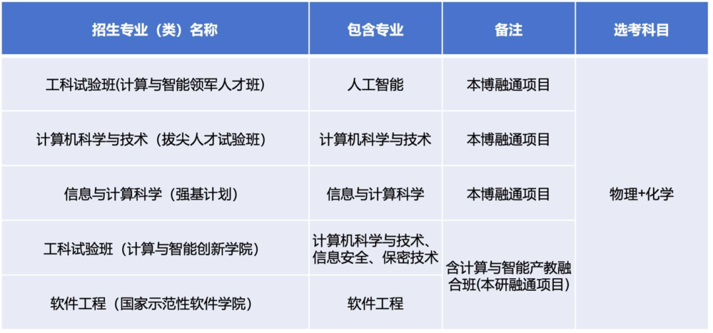

以上是25年的招生专业，预计26年差别不大。

26年综评招生：

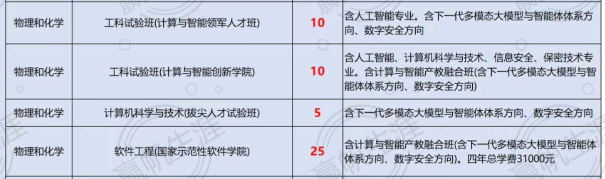

26年普通批招生：

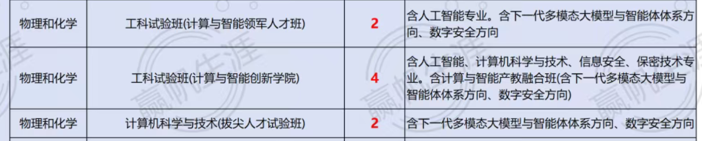

看这个招生的意思是，从26年开始人工智能专业会开只有本科的普通班，这个我不是很确定，建议后面具体和招生老师确认一下，因为我知道24级和之前人工智能专业是只有直研班的。24级之前人工智能专业因为只有直研班，所以也不能转专业转入，不过25级开始可以了。

班型来看，计算与智能创新学院主要分为领军人才班，也就是之前的aics人工智能（我是这么理解的），计拔（拔尖人才），信计（强基信息和计算科学，这个和大部分同学关系不大），以及普通班，主要是计算机科学与技术，信息安全，保密技术，软件工程。

#### 保研

据我所知计拔和信计大佬比较多，计拔每个学期是会有动态进出的，普通班同学可以报名选拔转入。所有保研班都要修读一定学分的荣誉课程，也就是会比普通课程难一些，任务量大不少，除此之外保研班保研的要求应该就是达标的绩点 + 可能要科研项目，具体可查阅25年的培养方案。

对于普通班，就要“卷保研”了。我们院系的目标是未来“绩点占比逐步降低至50%”，再加上绩点改革，绩点对保研带来的增益越来越小应该说是，更加看中科创，竞赛这些。不过保研具体的比例，名额，以及最后的考核方式每一届都不一样，也没有办法给出具体准确的数字，保守估计，由于保研班占掉了大量保研名额，普通班保研率大约至少应在20-30%之间。不过每年情况还是差异很大，也许大家在xhs上有所耳闻，计算机学院一直是放出消息比较多，对学校保研政策响应比较迅速的院系，大家如果特别担心这个方面，可以去各种平台包括知乎上搜索一下最新保研的流程和政策。

#### 学习内容

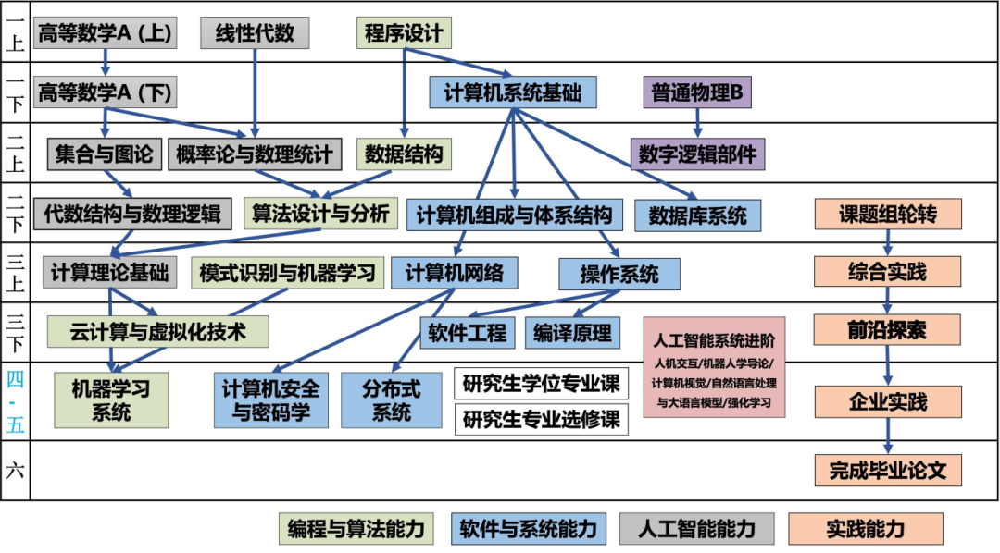

学习内容方面，按照如上图计算机科学与技术专业所示。整体来说人工智能，计拔，信计,cs，软工学的内容都差别不大，信息安全和保密技术相对差别会大一些，不过也主要是在大三大四的选修课方面。班型人数上，计智学院24级总共有约340人，计算机科学与技术普通班100人，其他班型就不了解了。选课上，由于计算机学院和软件学院合并，现在选课也都可以一起选了，每个课都开有大约2-5个平行班，虽然有的班型可能写限制条件是某某班级，比如24软工，或者24人工智能，但是只要课的代码一样，都是可以互认的，这点复旦还是比较自由。

#### 给分

给分方面，复旦计算机学院的老师给分相对还是很不错的，有一些老师甚至接近无限A-，也就是最后绩点是3.7-3.8/4.0。也就是说不论你是想好好学习获得一个4.0的绩点，或者学期中想干自己的事情，然后期末突击复习获得一个3.5-3.8左右的绩点，最后在成绩单上的成绩都还是相当decent的，这一点对未来想要出国的同学尤其友好（相比于其他学校）。按照我的感受，复旦自从24年6月份绩点改革之后，老师给分变的尤其友好，我想主要原因是老师如果不给同学高分，下一年的同学看到这个信息就不选这个老师了，这个也对老师造成了无形的压力。而计算机学院的给分相对又是全校比较友好的，相对来说同学卷度也不是特别大，再加上复旦的牌子还是相当不错，以及一些隐藏优势包括但不限于事少离家近，社团活动丰富等等。总体来说 **我觉得** 复旦cs还是非常适合像我一样的普通同学。

### 化学系

在填报或分流至化学系前请确认对于该学科有足够的热情与认识。

#### 课程内容

大学一年级主要完成大类基础课学习，包括高等数学，大学物理，普通化学等。进入大二后主要进行专业课，主要就是四大化学的学习。其中，物理化学分三学期，分别讲述结构化学、热力学、动力学；分析化学分二学期，讲述化学分析与仪器分析；有机为两学期；无机为一学期。另有一些杂七杂八的课程。大二至大三的四个学期，每周会有一天上实验课。总体而言，专业课难度不大，仅有少数课程（量子化学、计算谱学原理等偏向理论计算的课程）需要一定的数学物理基础，大部分凭借记忆和领会，以及揣摩往年题目（笑）即可通过考试。

#### 卷度

依照笔者经验（22级），一个年级总共约90名学生，其中有大约30人属强基计划，不过总体而言，普通学生与强基学生的差距仅体现在少数专业课中，不必担心无法卷过高中学习过竞赛内容的同学。

#### 科研实力

**有机化学方向，**虽然说有两个院士，但是似乎很少有周围同学选择有机方向读博，笔者认为主要原因可能是工作强度太大且工作环境堪忧。笔者对此了解不多，就不赘述。**无机方向**主要是孔材料（以赵东元院士为首的团队），以及各类纳米材料，总体而言比较强力。**物理化学方向，催化方向和电化学方向**似乎都做得不错，还有一批老师是做**理论与机制研究**的，主要是光谱研究和计算化学。分析化学和化学生物学笔者全无了解，不能妄下论断。详情请见化学系主页。

#### 保研与升学去向

目前化学系仅设立专硕与直博，大部分同学是选择直博（当然，笔者认为做出这一决定是需要谨慎思考的）的。在约60名普通学生中，大约有35人能获得推免资格，总体而言卷度不高。这是22级的情况，具有时效性，仅供参考。据院系公布数据，每年有不超过5人选择出国留学（这是否在某种程度上暗示了国际化程度？就笔者所知，每年前往国外进行交换的本科生也并不多），而超过80%的学生选择在国内继续深造。

### 物理学系

#### 10.1 普通班

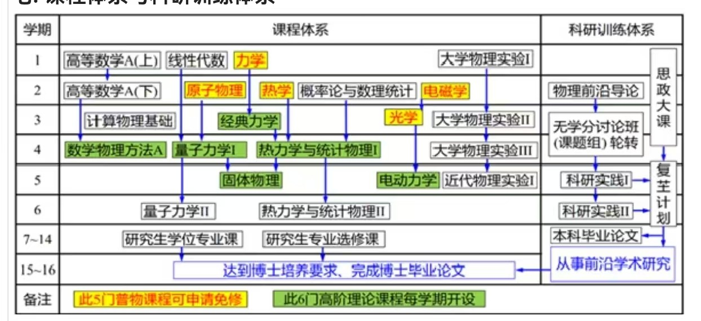

（不是强基不是英才班 无竞赛基础：培养方案课程如上图）大一上了一年的感觉：班里三分之一英才班三分之一强基 许多很厉害的人 有的课很友好但有的课老师默认一些人有竞赛基础（wsj原子物理啊……*enjoy*），总之如果想有比较好的学习体验，课下应该是要多花时间的。但确实也有人在此专业探索了很多专业课以外的东西 玩得很充实

量子与智能英才班（本博融通）

物理学+人工智能双学士学位，默认转段考通过后直接读博（博士只有物理学学位），也可以读完本科主动退出，选择考研/出国路径。

培养方案与普通物理系学生不同（详见ehall公布的培养方案文件），会有很多课程替换（eg 一学期的基础物理实验 instead of一连串的大学物理实验，不学概统等），但是要额外学模电、数电、程序设计、数据结构等较多工科课程。

2025级是第一届，班级人数较少（所以能很快熟络起来（？）），但由龚新高院士、沈健教授筹建带领。

适合自我定位无意研究纯理，想要理工科融合的学生（功利而言，可能更好找工作）。

别的还是留给先辈们补充罢

### 生命科学学院

进入生科院后，选择分流方向有：生物科学、生物技术、生态学。

#### 英才班/非英才班

生物排除强基一共分为英才班和普通班两个班型。英才班和理化的一样是八年的本博融通，培养方案会和普通班有一定的差异。英才本科生阶段3年研究生阶段5年。有动态进出机制（主动退出和考核不合格退出，不过考核要求没有那么严格），如果有人退普通班也可以通过面试进入英才班。

#### 保研率

生科的保研率近年在40%以上。保研名额是院系内共用的，也就是说生态学和生物科学是放在一起计算的。其中生态学由于人数较少往年会确保给到生态学1个名额，不过自24级开始生科院开始自由分流选择生态学的都是真爱所以不少同学绩点都是很靠前的。

关于保研的卷度，生科院整体的卷度和平均绩点都不算太高，大家好像都比较佛系（当然也可能是个人比较佛系，复旦绩点改革后在4.0上下也有一些的）。不过由于英才班的出现普通班的保研名额可能会被大大压缩（这个目前没明说，但是除去强基英才班的人数基本达到了40%）

#### 11.1 生物科学

#### 11.2 生物技术

生技今年可能会有大变化，主要是由于复旦新开了生物技术学院（算是工科），生科的培养方案也在重新调整。25级生科院院内分流直接没有生技的选项了（原因好像是生技培养方案在改造，且在开学时由于生技院刚开没有招生所以通过选拔考直接从生科挖走了一批人），不过目前看来26级生科院的生技应该会恢复。

所以目前同时有理科和工科，可能得等今年的培养方案出来

#### 11.3 生态学

**学科介绍**

生态学是研究生物与生物、生物与环境之间的关系的一门学科。

复旦生态学有许多老师扎根不同的项目，学科分工完整。由于地缘等因素，复旦生态学主要优势的方向在以下四个主题：生物入侵生态安全，全球变化与生态系统响应，生物多样性与生态系统服务，关键生态区动态与健康维持。

由于友校没有生态学的本科点，所以复旦生态是喜欢生态的同学的不二之选！

或许大家会觉得生态学需要经常**野外考察**，会很辛苦很累，确实是这样的。不过出野外也是大部分生态人的乐趣，所以可以说是辛苦并快乐着。不过当下技术进步，也有很多生态学家将工作的主战场投入到了数据分析、建模等**室内工作**，有时仅通过收集各种数据也可做出不错的成果。所以喜欢自然但无法长期在外工作或体质一般的同学也无需担心！生态的世界很大，定有你的容身之所。

或许大家会觉得生态学家主要是做观察调查，但现在生态学许多前沿进展背后都是强大的数理功底在支撑，许多数学专业的人也都投入了生态学研究（如果数学学的好也可以考虑走这条路哦～能学下来就完全可行！）。

**课程内容**

生态大一和生科是差不多的方向，就是要学数学，物理，化学，生物以及相应的实验课。到大二就开始学动物学、植物学、种群生态学、群落生态学、生态系统生态学以及还有有机、生化、微生物、遗传（后面这几个生科也要）。在接下来的专业选修，就是具体到一些比较细的方面，比如说你可以去研究动物学，就像鸟类或者动物行为；还可以是环境角度，比如说土壤生态、湿地生态；也可以是技术相关，如生态遥感之类的内容。

除了课堂内容外，在暑期我们还有据说非常精彩有趣的天目山野外实习等由教授带队的实践项目，值得期待！

由于生态学学生很少，24级第一届自由分流只有5位选修生态，25级是13位，但是教授有40+位，师生比感人！

**就业发展**

首先本科结束后基本都会选择继续深造。

完成学业后不转行的话大部分应该都从事科研工作，可能留在高校研究院，也可能进入事业单位工作（自然资源部和生态环境部下属单位），或进入生态环境、林业、海洋相关企业公司，也有的参与教育或教育传播工作、科研和产业转化等等。

关于生化环材就业困难问题，老师的评价是：复旦出来的不用担心找不到工作（前提：非本科生就业）

**其他**

**生态学**无疑是一个**非常有趣的专业**，就读期间，告别大一的专业基础课后，基本就都是可以全凭自己兴趣选择的各种小班专业课，还会有丰富的机会参与户外实践活动（公费旅游😉）。当别人在教室里上课时，生态学的学生可能会在草地山间自由地晃荡，在常人无法进入的保护区里欣赏落日余晖。喜欢摄影的同学有机会蹭到同行大佬的高端设备，喜欢吃的同学有机会在外勤时吃到外地的特色美食。（以上内容基本出现在户外科研实践中，一定要抓住进组和出去的机会！）

不过离开学校，生态人过的怎么样呢？我不清楚。他们会赚很多钱吗？大概率不会吧哈哈哈哈。我无法预判10年后生态学是否会站上风口，或许会，也或许不会。可能相比于热门的工科专业等等，生态学永远都赚不了那么多的钱，而且也难以再转入这些有专业壁垒的行业。所以**对未来有强就业导向以及赚钱需求的同学，生态学大抵不是一个好选择**，一定要慎重。但在此之外，是我认为，人们的生活离不开自然，生态环境在未来会越来越被重视。对于社会，生态学研究的价值和意义是永存的，而且会愈发珍贵；对一个人，生态学可以将我们与万物相连，在这个偌大的世界里，找到自己、认识自己。生态人会过得开心吗？应该会吧～生态人会过的幸福吗？应该会吧～

研一生态学在读的学姐之前问我：你有考虑过将来的工作吗？

我笑着说：只是喜欢，选这个专业的大概就不考虑就业了吧哈哈哈。

她也笑着说：哈哈哈哈没错，我也是这么想的！

所以，如果要选择生态学，那大概离不开一个理由，热爱。热爱这个学科，热爱这片土地，热爱每一个独一无二的生命，热爱这和谐统一的精妙的星球。

### 核科学与技术系

（抛砖引玉：听说又名物理2系且刻板印象是课程还是资源都是低配版物理系 有些课程设置和物理系相似但压缩了一点内容 更专注于核科学 不知道有没有这个系的说说）

#### 细分方向

【摘录自公众号】核系目前开设有核工程与核技术专业（国家一流建设本科专业） 、物理学专业（核物理方向，教育部第五轮学科评估 A+专业）及人工智能 + 物理学（核物理方向）双学士学位班，正在建设聚变科学与工程交叉学位点。

（来自23核科的学长）专业内部是有分流的。我这届是分核物理（理科）方向跟核技术（工科）方向，分别为核物理卢鹤绂班和吴征铠班。然后分流的时候基本上是遵循大家志愿，基本上1:1分没什么难度。现在每年三月会选拔“卢鹤绂拔尖班（院士班）“，是本博融通的班型，三年级本研分流，六年级硕博分流。

25级开始新设立了“聚变人才领军班”，录取后可以选择核工程与核技术专业或者物理学（核物理方向），大三通过考核可以推免选择本硕融通项目或者读博。

我可以介绍一下聚变科学领域。东昇聚变公司就是我们系孵化的企业，投资已有上亿美元，然后目前来看还是比较有前景的，尤其是聚变方向。它在引进成都那边的聚变的一整个组的很多教授以后，应该算是国内单位的top one.

#### 保研和卷度

核科这边不是特别卷，保研率在40~50%，但是这个保研率是含各项例如国防指标、补偿指标之类的总体保研率。

#### 课程内容、科研、评优

课程方面，大一大二基本上是跟物理系相同课程，大三大四的话是更偏向自己系的课程。然后大一大二的跟物理系上比较难（模电，数理方法，量子力学），然后自己系的课开的比较简单，比较好做。四年里每个学期都有实验课，需要写四年实验报告（）

我们系是卢鹤绂班需要在大一开始做科研，一年两年时间内要完成一项简单的科研任务，但是是比较正式的方式，包括立项、中期跟结题答辩，然后也会评优。

我们系的学科评优方面（学科评级）是有很多评优的内容是拿到物理系评的，所以在核科方面的评优会看上去不是特别好。但是，实际上，我们也是有很多成果的。

#### 就业/研究生前景

作为上海的学生的话，可以选择的基本就只有上海辐射安全中心，这几年还招本科生，过几年可能要求研究生；然后还有个核动力研究院，搞托卡马克聚变方向的，目前是刚来上海，具体怎么样还不清楚；本系读研的话如果是保研，那还有比较多方向，主要是理论研究方向，反应堆设计人不多，如果考研本系那就只有一个工科的方向，研究核电子学，感觉前景比较一般。但东昇聚变这样子的企业确实也有相关岗位，具体情况要向从业者询问了。

总而言之，不想太卷来我们系是很不错的选项。聚变前景也好。

#### 其他

系里同学大量来自农村专项等计划，因此贫困生比例非常高。

### 大气与海洋科学系

**不限地理！不限地理！！！编者本人选课物化生！！！**

**专业官方定位**

复旦大学大气与海洋科学系成立于2018年4月20日，是复旦大学首个地学学科的二级学系，也是上海市首家大气与海洋学科相结合的人才培养基地。2022年大气科学本科专业获批国家级一流本科专业建设点；在国家“双一流”建设中，大气科学是复旦大学重点建设的一流学科之一。2022年以来连续在泰晤士高等教育公布的中国学科评级中获A+等级。

**培养方案和课程设置**

学习内容

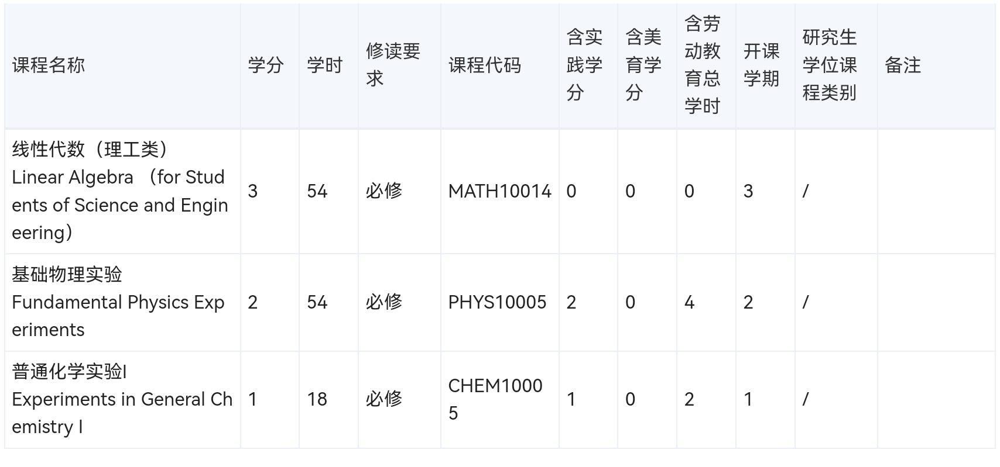

数学2025学年接2026学年的时候变化有点大，编者自己没有去详细了解过，25级培养方案是在数学分析B、高等数学A、高等数学B中选一个修读（但双学位要求高数A以上，如果一开始想好了要读人工智能双学位，那大一第一学期选课的时候一定一定要注意，否则后面要多读一学期高数）

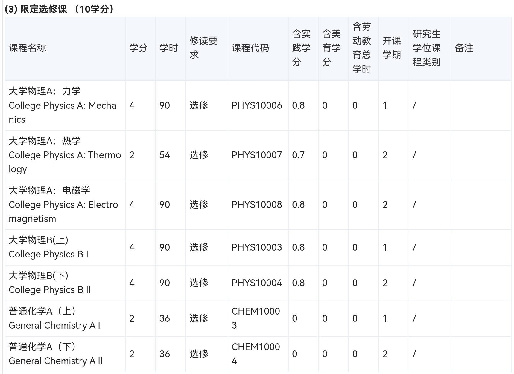

这一块儿选10分就可以了，意思是如果实在不想学化学是可以全选大物A的。一般大家会选择大物B加普化A，或者全修大物A。

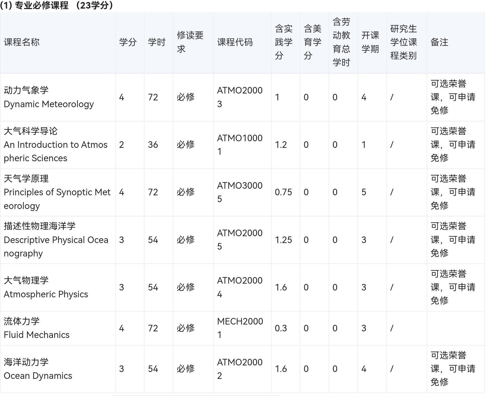

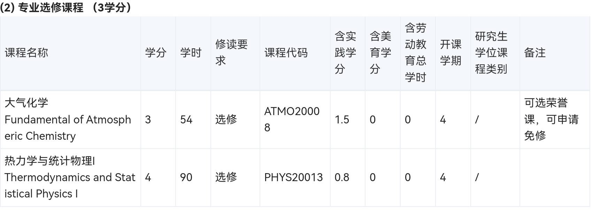

然后专业课本身偏地理+数理，可能最主要的还是物理。课程本身非常好玩（也可能是因为编者自己也刚刚开始学，难度还很小）。

上面列举的一些只是专业内容的一部分，还有很多很多选修课，比如中小尺度气象学、气溶胶-云-气候相互作用、大气辐射学、热带气象学、天气分析与预报、海洋气象学、大气探测、数值天气预报、统计气象等等，然后AI课程方面可以选一门叫“气象大数据与人工智能”的课，其它像是Fortran、Python都是最好要学的。当然，数学和物理是肯定逃不掉的~

在课程方面，我们最大的特点可能是 暑期课和实践活动 非！常！多！！！，选“海洋调查与实践”这门课会要求上雪龙号出海考察，选“气象预报与预测实践”会去上海市气象台参观学习，授课老师是首席预报员。“专业科研训练”那门课也是会出去玩（比如我们今年这门课的目的地是西藏，就是这个暑假会去）。

具体科研、培养方向的话，大致分为四个方面：气象学与大气环境、气候系统与气候变化、大气物理和化学过程、海洋气象学与物理海洋。（这个是编者在老师给的PPT上看到的，但编者自己记得的好像不太一样，好像是：大气化学与气溶胶（偏化学）、海气相互作用（偏物理）、气象大模型（偏AI或数理）、气象金融（偏金融），这个确实好像有点信息参差）

**活动和社会实践**

每年最盛大的活动大概就是气象日和海洋日了，会有专门的游园会，有入夏竞猜、梅雨竞猜等各项活动，然后讲座也有很多。平常思政课会去相关单位参观了解，春秋季的日常化实践项目都会好好做，像是我们上学期去了环境检测中心，这学期是崇明的西沙湿地，平常活动很多，而且几乎都不强制。然后我们在江湾校区有自己的环境检测场，有专业的百叶箱、雨量计，等等，平常会有专门的参观。

除此之外，我们还会有很多院系立的项目，比如这个暑假我们考完试马上就要去新疆做暑期实践（不过这个是自己报名的，对，主观能动性很重要，越积极越好玩），然后会和院系内、学校里一些实践方向的组织联合搞实地考察，如果不想去实地的话在后台跑数据也很锻炼。

然后我们以学生会和专门的气象群（就是寒假里因为冷流雪火了的“观云梦雨”学长建的）为中心建了“风云气象社”，目前刚刚起步，但暑假已经有去三峡的活动了，平常也会负责校园天气预报提示、开开讲座、安排一些沙龙活动等等。

反正就是，实践项目非常多，只要有点主动性，都有很多机会。

**保研率/卷度**

我们大气与海洋科学系，25级本科生，17人（大气科学，大气科学-人工智能，地球物理，地球物理-人工智能，这四个加起来），但经费不少。懂的都懂。所以资源肯定是足够足够的，而且老师都很好，如果说本科阶段就想做课题、做项目，大可以直接冲进江湾环境楼直接敲老师门（bushi，还是得提前发邮件的）。

（然后就是因为人少，所以每个人普遍存在感都比较高，大家的关系普遍会比其他院系紧）

如果说编者作为强基生，绩点没有参考价值的话，从目前的角度看，我们专业第一绩点也就3.7。所以可以说，如果真的不想卷绩点，大气科学专业是个非常好的选择。

保研的话，，，说实话编者没有仔细了解过（dbq）。但就就业方面看，编者个人主观的建议是，至少要读到硕士。至于要不要读博，就要看想去什么样的企业了（比如上次去上海三峡勘测设计研究院的时候，听那边老师的语气，应该是更喜欢硕士生）。

### 大数据学院

#### 官方定位 学科专业简介

复旦大学大数据学院于 2015 年 10 月 8 日成立，这是百年复旦在建设世界一流大学和一流学科征程中，瞄准国际科技前沿、聚焦国家创新发展、激发学科动能的重大战略举措。学院致力于大数据相关的科学研究、人才培养和产业创新，以计算机科学、统计学、计算数学为三大基础支撑性学科，与信息科学、生命科学、医学、经济学、社会学、管理学、环境学、工学等学科领域进行深度的交叉科学研究和成果推广应用。学院探索全新的学生培养模式，起步早、布局优，着力打造扎实的数据科学研究和应用的各类平台，十年来，为社会培养了一批基础扎实、眼界宽阔的数据科学人才。

#### 英才班与非英才班

25届数据科学与大数据专业的专业填报指南上分为了英才班与非英才班两个班型，实际上这个名字充满误解，其政策实施更贴近于六大创新学院的领军人才班，招办会告诉你是该班型实行本博融通的政策，顾名思义即八年本博连读，在本科三年级与五年级阶段存在转段考核，本科三年级通过考核即可攻读研究生（即本校保研），理论上转段考核是基于你的科研经历，绩点的综合考核，但实际上只要绩点达到3.3（一个相对较低的标准）+一次fdurop（学生科研）即可，而在五年级的转段考核可以选择中途退出计划，即只读完硕士学完，换而言之，此计划可以理解为本硕连读或本博连读任君挑选，

非英才班的保研率约25-30%，有把握请优先考虑英才班

**学习内容**

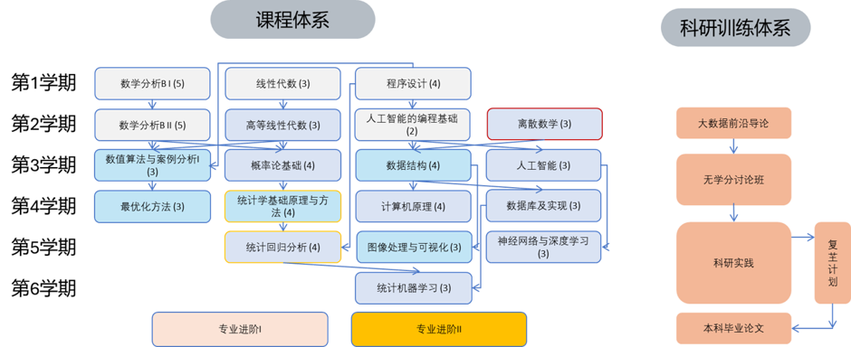

从上图可见，专业必修内容围绕数学，统计学，计算机的专业课程进行展开

数学部分：数学分析，线性代数，概率论（实变函数以及概率论），高等线性代数（矩阵论），数值算法与案例分析（数值线性代数），最优化原理，离散数学

统计学部分：统计学基础原理与方法，统计回归分析，统计机器学习

计算机部分：计算机原理，图像处理与可视,C语言程序设计，数据结构与算法，人工智能的编程基础（深度学习基础），机器学习，数据库及实现，神经网络与深度学习

专业学习不意味着仅限于与专业必修课程，专业进阶课程也需要修满一定的学分：包含数学领域，人工智能领域，交叉领域的深耕延拓，以下展示部分

**数计板块**

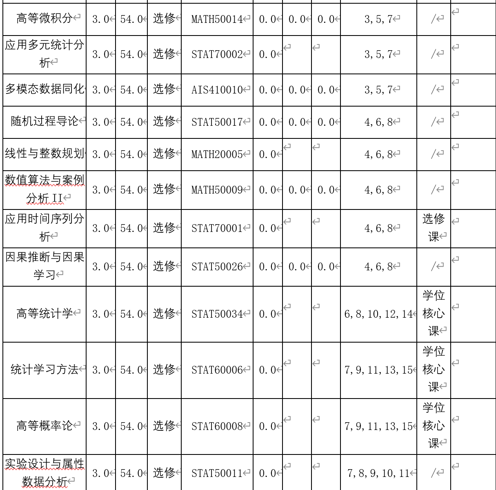

**智计板块**

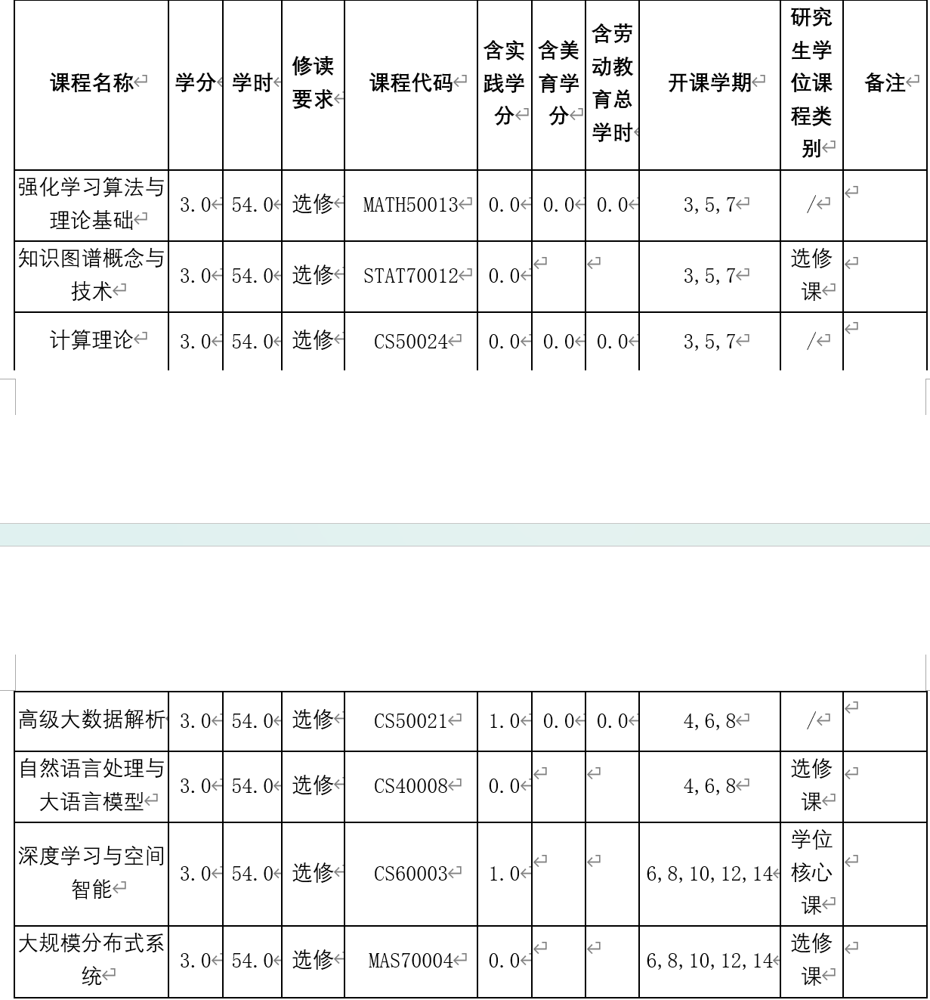

学习理论是专业的重要基础，但不同于高中，大学阶段你的科研经历更为重要，在实验室跟导师做项目能帮助你更高效提升论文阅读能力，模型训练等实践能力，能够从头到底接触跟进乃至负责一个项目能帮助你更贴近于生产实践，无论是研究生保研，大厂面试，都注重你对你负责项目的成果与理解，所以英才班赋予了同学们适当摆脱绩点压力，从而使同学们更快投入到科研实践中。

#### 数据科学与人工智能的联系

AI中图像文本和特征都是以高维矩阵或张量形式存在，高等线性代数（这门课相当的重要，也相当的难）中关于矩阵分解、特征值、奇异值分解（SVD）的知识，直接支撑了第5、6学期的神经网络与深度学习以及统计机器学习。

最优化方法：AI 模型（如神经网络）的训练本质上是一个寻找最优解的过程。而第4学期的最优化方法提供了梯度下降、凸优化等核心算法，这是训练现代 AI 模型的关键。

机器学习（特别是传统机器学习）很大程度上是统计学在计算机上的工程实现。一个很简单的例子：经过训练的模型会根据投喂的测试图片基于统计学模型计算出各个对象的概率分数，并给出预测。

数据科学于人工智能而言形同手足，大学一至二年级注重前沿算法，人工智能的底层原理学习，三年级等高年级课程注重实践操作，研究生阶段学习发展方向取决于你所选导师，主要分为统计（偏学术方向），大模型算法（偏应用方向），金融等方向（以前两者为主）。

#### 就业去向

据25 届一位研究生学长所述，其身边统计学大部分去大厂，如哔哩哔哩，小红书，腾讯，字节跳动，应届生毕业年包高者有 70-80w，也有 50-60w，30-40w 起薪，互联网大厂基本起薪都很高，数据科学的本科同学到研究生阶段基本都是以大模型算法为主（如果以就业为导向），大家可以以 boss 直聘大模型算法岗位作为参考。

### 相辉学堂

下设相辉计划、香农计划、长水计划三个方向。前二者属于物化组，最后一个属于不限组。

相辉是理科（包括经济学），相农是工科。相辉学堂的同学可以在本领域自由选专业分流，也可以跨领域通过考试分流（比如相辉通过考核面试啥的去选一门工科）

#### 15.1 相辉计划

#### 分流方向

数理化生四大基础学科。分流后按理科实验班（本博贯通）算。也可以通过面试转到香农或者长水计划，如果觉得数学英才班的进度跟不上，也可以选择读普通班或者经济+数学或者AI+数学（这一块儿我也不是很了解）。分流最好把握住大一寒假暑假两次机会，分流后应该就和分流到的专业的同学没什么区别了（除了每周的相辉讲堂）。据这两届的数据，大部分相辉计划的同学都会选择数学普通班或者英才班，所以如果选了物理化学或者生物，可能会面临身边的人学的专业和你都不一样的问题。

#### 优势

虽然学校官方宣称相辉没有选课优待，但根据我这两个学期的选课，确实会有一定的选课优待（专业课基本不会被roll掉，而且可选的课可以覆盖多个专业，也方便大一分流的时候有更多选择）。学校会鼓励做一些科研或者申请复芏计划。

#### 局限

因为目前相辉计划和香农计划只办了两年，所以培养方案不够完善和成熟，有时候我们自己也搞不懂学校的培养方案，明年不知道会不会有改变。

#### 15.2 香农计划

#### 分流方向

集成电路与微纳电子、计算与智能、生医工、智能机器人与先进制造四大创新学院。大一寒假通过分流进入后按领军人才班享受政策。

#### 优势

我觉得主要的好处是锻炼一下主动获取信息的能力，我大一上找了好几个专业的教授去问；相辉会鼓励提醒我们用好学校的资源。剩下的什么相辉讲堂就是形式主义了我感觉。

## 不限组

### 经济学院

重要提醒: 经济管理试验班属于管理学院，要求物化双选。经济学类属于经济学院，不限组可填报。

26年了，商科还能报吗？笔者的答案是，①市场相对回暖了 ②如果能想清楚自己要什么，商科仍然是一个合理的选择。经济学院的老师大部分人都很好，且课业压力相比理工确实要小。多出来的时间可以让同学们尽早投入职业发展的探索，比如实习比如打商赛。

至于就业，首先是传统金融，分一级市场和二级市场。一级市场主要包括：VC、PE、FA、IPO工作；二级市场主要就是研究员的工作。咨询行业过去炙手可热，现在也依然可以作为职业起点，常常是商科同学们的第一份实习去处。除此之外，保险（精算）也是经院一大对口去向。太平人寿就有不少复旦校友（数院/经院都有）。以及财政学和经济学都为考公提供了较好的条件。不做传统金融，互联网（运营/产品/战略/商分数分）也是经院人近几年的去处。这一个个名词具体是什么意思，善用ai/知乎/小红书/b站进行自助搜索。

经济学院作为复旦社科的老牌院系，科研的资源也是相当不错的。有兴趣的同学可以搜索“复旦大学经济学院”公众号探究。

多说两句：事实上，笔者认为经济学院（以及管理学院）的同学们普遍职业意识觉醒较早。代价是，在大一大二不可避免会比较焦虑。但好处是，能比其他专业或许更早地接触市场和社会。毕竟如上文所述，课业压力相对较轻。但如果你觉得这会让你过分焦虑以至于没法保证身心健康，那还是选择一个能躺平的地方罢。

#### 1.1 数理拔尖经济班

【编者注：今年上海似乎无论综评/普通批都不招生，可在来年分流前报名，通过考试和此前修读相应数学课录取】

要求修读一些荣誉课程但直博（好像也可以选择研究生路径），是直接占普通班保研名额【编者注: 普通班保研比例由此从30%掉到了25%左右】的，所以如果对数学没有那么排斥不妨考虑一下此班。

#### 1.2 uipe国际课程班

#### 选拔时间/方式

报考经济学类之后【注意，填报志愿时并不存在这一个班型。但是如果你很想进这个班，得报考经济学类。国际金融学院的全英文授课班又是另一个专业了。】，8月底会寄到家里来一份纸质文件，上面有uipe的报名链接(一个二维码)，扫码填报。9月初会在校内进行全英文面试。25级报名人数少，所以点击即送。

#### 课程/师资设置

uipe采用全英文小班化授课(大概30个中国人，20个不到留学生)，上海同学基本问题不大。文科同学比较关心的往往是数学课程的难度。uipe修读数学分析B，但考试难度近似于高数C(或者c到b区间内)，所以可以放心。老师都是相对年轻的海归老师，很乐意和学生私下交流。日后联系做课题很方便。

另外，由于是英语授课，uipe包括数学课在内的所有专业课是单独开设，因而每年选课时往往专业课不必和其他非uipe同学一起竞争好的专业课，抢课压力相对较小

#### 资源

如前文所叙，师资资源是一大优势。除此之外，uipe届与届之间往往联系更为紧密。*UIPE FDU*是uipe班型从19级开始的大群，里面会共享实习资源。这在经济学院其他平行班里是少见的。

同时，uipe在日常活动上也更为丰富，包括但不限于班级组织的春游/企业参访等。

#### 保研与出国

uipe的保研率和经院平行班并无差异。但是uipe的同学们有一大部分会选择出国，因此历年来出现过保研名额用不完的情况。（补充：近年来由于出国热潮下降，以及经院整体分给各非数理班的保研名额减少，加之有可能面对uipe内部相对较卷的同学，对于新进来的同学保研名额使用是否存在优势尚不明朗）

出国申请上，由于4年的全英文课程，同学们往往申请时会有一点优势，但不太多。主要还是视野会更加开阔，我认为。

#### 注意点

请家境并不十分良好的同学慎重考虑。不是说学费更贵开销更大，而是你的同学大概率家庭条件较为优越。如果你相信自己的韧性觉得自己不会在这样的环境中产生很大落差，那么也请勇敢冲，这不会使你后悔。

第二，笔者于去年11月选择退出了uipe。原因有很多，但是主要是进入大学后不适应导致的心理健康原因。这并非uipe所致。但是我想说的是，如果你需要一个松散的i人友好的环境，我也不是特别推荐uipe。这个地方需要较高程度的自我展示以及社交能量【大一上学期必修课:English Public Speaking很能体现这一点】。事实上商科我认为都同理。如果你日后想做科研，那会好一点。或者做二级市场的研究员岗位。总之结合自己的性格好好考虑。

#### 1.3 国贸-大数据双学位

#### 选拔时间/方式

同uipe,报考经济学类后，将于8月底寄送纸质材料至家中，9月初在校内进行面试。

#### 课程/师资设置

双学位课程同时在两个学院开设，有助于扎实打下数学基础，适合希望在大一大二阶段集中提升数学与编程能力、暂不急于参与金融实习的同学。相较于新开设的AI双学位，笔者认为大数据学院的课程内容更为务实，避免流于形式。课程体系与量化金融就业方向高度契合，笔者两位室友即凭借该背景本科毕业即入职百亿私募。

#### 资源

学生可同时享受大数据学院与经济学院的师资资源，并有机会与大数据学院从事大模型研究的同学深入交流。

#### 保研与出国

双学位保研名额与经济学院其他分流方向分开计算，保研率与其他方向持平。部分同学选择本科就业，亦有部分同学选择出国深造或申请卓博项目，因此保研名额相对充裕。

#### 注意点

若对数学兴趣不足，需慎重考虑。尤其大二阶段的数学专业课压力较大，且大数据学院部分教师给分较为严格。

### 法学

#### 2.1 概况（住宿、学工、给分、竞赛等）

法学院两个班型目前到25届为止都属于同一行政班，班级活动等都是一起的，没有明确区分。大一在邯郸校区，后三年在江湾校区【大一有概率住在留学生公寓豪华单/双人间且独立卫浴且有电梯且每层楼有洗衣房开水房和厨房！强烈推荐！！】，江湾校区大概率为老园区四人间，设施称不上新但是也不算旧，宿舍空间比较大，有阳台。法学院军训统一都在江湾篮球场，树荫很多，大部分时间不用晒太阳。

法学院比较特别的是学工和入党氛围异常浓厚，所以这方面的竞争会微微有些压力，要求会更高。学生工作包括但不限于班委、法律援助中心、青年法学会、法学院分团委学生会等等，如果想好了选调/考公的话这些经历是一定要有的，如果选择本科就业/出国的话就不需要在乎这些了。

总体而言法学院专业课不少，学习压力还是有一点的，但大部分老师给分都还可以，所以达到基本线压力不大。个人基本的学习节奏就是学期中正常听课（有时候也不听），期末每门课基本上突击2-3天（极限状态下1天），只要选课不踩雷，基本上达到平均水平都比较简单。但问题在于同学们大部分都比较认真，所以中部以上绩点相对较高，想保研的话需要把握好每一门课。（目前24、25届中位绩点都在3.8左右，24届普通法本保研线大概在3.87-3.88）

法学院考研比例很少，由于上海法硕初试压分的原因，即使是旦本的同学都很难过初试国家线，因此每年考研本校并且最后上岸的同学都只有一两位。（也就是说保不上研建议直接出国或者就业）

法学这边的核心竞赛基本就是各个模拟法庭（Moot Court），复旦这边其实模拟法庭的竞争并不是特别激烈，尤其是大型的国际性质的模拟法庭，因为需要投入的时间成本还是挺高的，不过有兴趣的同学可以和高年级打模拟法庭的同学多交流，入队机会还是非常多的。从个人体验来看，国际法相关的模拟法庭对个人能力的提升相当大，不过就个人发展而言还是需要权衡一下的。

#### 2.2 培养方案

目前法学院有四套培养方案：普通法本、涉外法治拔尖人才班、法学-经济学双学位、法学-人工智能双学位。（24届数据）普通法本141学分、涉外147学分、法经和法ai都在180以上。

涉外在普通法学的基础上增加了一定的全英授课的课程，据说会优先提供对外交流或涉外实务的机会，但目前来说暂时还没有明确安排，课业压力和普通法学基本没区别。24届涉外在大二的时候组织了二次遴选，对普通法本的同学开放，但之后是否还有二次遴选并不确定。法经双学位和法ai双学位的课业压力都相当繁重，尤其是大一大二，个人建议是慎选，除非想清楚了要转金融/转码。

#### 2.3 保研与出国

保研方面，四套培养方案分开计算保研。普通法本保研率30%左右，涉外保研率50%左右（但目前24涉外50%的绩点和普通法本30%的绩点是一样的）。两个双学位这边，法经双学位大概率保50%，法ai是新方案，暂时没数据，不过大概率也是50%（法ai双学位理论上可以跨保计算机，但还不确定）。双学位人数都不多，具体保研率要看这一届具体选双学位方案的人数而定。目前法学的学硕学制均为3年，此外排名相对靠下的同学也可能会选择直博。（学硕优先级大于直博）

出国方面，近年来由于就业形势的问题，考公选调的比例显著上升，因此出国的数据在一定程度上还是萎缩了。出国的头部数据基本集中在牛剑的LLM/JSD（绩点前五），LSE的LLM，US T14的LLM、JD（T6的Columbia和NYU还是比较罕见），NUS的LLM以及HKU和CUHK的JD。中下部数据则包含Lower T14的LLM，UCL、KCL等英校的LLM以及HKU、CUHK的LLM（非常多，每年都有10+的港校LLM）。从班级整体来看，每年选择出国的同学大概在30位左右。

#### 2.4 就业方向

法学的就业方向确定性比较强，也比较明确，基本就是以下几个方向：1、律所；2、公务员（法检系统为主）；3、企业法务（社招为主，应届校招非常少）。律师又可以分诉讼和非诉两个大方向，头部法学生中更多人会选择诉讼方向，但非诉也有好的业务线，如并购等。我院本科体制外就业数据并不差，每年都会有头部外所的留用，以及一些红圈和头部精品团队的留用，可能可以占到整个班级的10%-15%左右。

至于体制内的就业，大部分同学应该会选择保研后再选调，当然也有本科毕业直接考公的，但相对较少。体制内就业数据还是挺好看的，几乎可以覆盖各级法检系统，但是问题在于上海法检待遇远不如苏浙，这方面比较尴尬。

#### 2.5 学院资源

说实话在学院官方层面能给学生的资源真不是很多，标准的就业实习双选会这些肯定是都有的，也会不定期举办一些律所参与的实务活动，让本科生有机会和律所进行直接接触。对于意向本科结束后出国留学的同学来说，我院的公派交换资源其实还是比较充足的，加上现在出国热度不高，交换这边的竞争也不是很激烈，算是一个小红利，值得考虑。

其他的就业实习方面的资源基本还是要靠自己network。我院相对还是比较团结的，有FDU法律职业社区等小团体，高年级的同学会很愿意发布一些实习继任的信息以及内推信息等。如果意向是体制外就业，一定要多和高年级的同学交流，大家都还是比较乐于助人的。

### 文物与博物馆学

我系26年转专业转入0人，转出5人。

如果想要报考文博系，除非兴趣极其浓厚，笔者的建议都是尽量不要报考，进复旦后如果旁听课程之后仍然感兴趣，可以通过转专业的方式进入。

关于培养方案：

25级现有文博、文博（科技考古）、文博（博雅班）本博贯通三套培养方案。课业压力：文博＜文博（科技考古）＜＝文博（博雅班）。其中科技考古需要学习高数B、生科导、普物B，普化C，有机化学C，文科生可能需要在志愿填报中对此进行思量。

\*文博与文博（科技考古）均可进入博雅班，25级博雅班目前仅有一人，通过高考招生进入，大二起将进行考核补入，动态进出。

笔者对培养方案的体验：

课业整体较轻松，每学期约22-24学分。通常经过一年的专业必修课学习、确定方向后，开始选择专业进阶课程，大三会进行策展。

专业进阶课程考古学/博物馆学方向居多，文化遗产方向尤其是不可以移动文物方面的课程设置较少，对比友校的课程建设略显不完善。

总体来说更需要课余时间自己探索学习，课程收获有限。早点确定方向比较好，笔者现在依然摸索迷茫有点痛苦。

科研/实践资源：

科技考古方向的科研资源较为丰富。

\*\*\*请注意：我系没有考古实习基地，只会组织去长江口二号考古工作站参观。

升学：

往年国内升学数据平均50%左右；26届28人，保研本校6人，供参考；博雅班对保研的影响未知。

### 国务学院

国务学院下分4个专业：政治学与行政学、国际政治、行政管理；以及2026年开始面向高考批次招生的国际组织与全球治理全英语项目。另外行政管理+人工智能的双学位会在大一下分流。

笔者发现26年应该仍然是“社会科学实验班（国务学院）”的名字出现在招生计划手册里，等到入校以后分流。（一般是大一上或者大一下，每年情况不太一样。

大一期间大家普遍会选择先修读社科相关的大类基础课。不过从26级开始要注意，国际组织与全球治理采取全英语教学，所以和其他三个专业的培养方案相比，在建议大一大二期间修读的必修部分有很大不同，具体政策还是要看学院怎么安排了。

#### 4.1国际组织与全球治理

突然发现复旦招生公众号上，国务学院的招生宣传居然没有特别宣传我们这个小专业…（其实复旦大学公众号应该有介绍过。）但是毕竟是新增专业啊，来宣传了！

25级有已经开始有一小部分学生加入这个专业，不过隶属于国际政治专业下属，26年应该会成为单独的专业。

也就是说，这个专业还在建设之中。

笔者当时进入这个项目看到的内容和“新增四个专业”那则公众号文章的内容是基本一致的，所以那也是我对于这个专业的最初印象。

实际上：

#### 专业相关技能点参考

首先这个专业本身在全国范围内而言算是比较新的，那么对于复旦来讲更是如此。以下结合具体情况，笔者分析了自认为的一些对于学生的能力要求，总之仅供参考。

作为一个全英语项目，笔者认为最重要的是英语听说读写能力。25年开学面向在校学生选拔的时候采取全英语面试；平时上课发言考试写论文都是使用英语。不过对于上海学生而言不用特别担心。**读写**：专业课的教授们会希望学生尽可能的阅读提前发布的文献内容，一方面让大家提前了解课程内容上课也会以此作为讨论内容，另一方面经常性的作业就是写论文&读书笔记。所以对于大家的英语阅读/写作能力要求比较高。虽然说科技发达。**听力**：老师们大部分没有什么口音，不过不排除有些老师语速比较快or英语太好（有位老师会开设一门建议大一修读的必修课😈，后续ta也会经常出现）。**口语**：如果不是特别愿意加入上课讨论也问题不大，虽然部分课程会要求上课发言作为总评分的参考。绝大多数课都会要求学生们做个人pre，不过可以当reader。当然如果你愿意，也可以当rapper：）

另外，笔者认为比较重要的是政治学/历史内容上的兴趣。由于是国务学院开设的专业项目，专业设置上依然围绕国际政治/外交学/区域国别学/社科方法论的内容，而不是尤其聚焦于国际组织，虽然和其他三个专业相比更聚焦。有部分老师很喜欢在课上讲解时政新闻作为讨论内容。专业文献也是围绕政治学/历史学相关的内容居多。如果没什么兴趣+英语文本，可能会觉得比较枯燥甚至难以理解。其中，政治学的内容，笔者觉得和初高中的政治课又不一样；但是历史学科的很多内容可以迁移。

最后抗压能力比较重要。这个体现在各方面。首先要心平气和的面对每个学期理应开设的专业课选项不多这件事情bushi（这一点26级应该有在改善！）。不过，这不是坏事，因为学分选多了你发现可能完不成任务，是谓第二层抗压能力。最后，“大家好像什么都会，我好像什么都不会”…（笔者的主观感受，以及伏笔\*1）笔者是比较完美主义的人，有时候也觉得有点苦的。

还有一些细碎的。是否愿意接受各种各样的观点/是否愿意认真了解过去基本上没有了解过的新领域（但不妨碍世上存在学识渊博的同学们）/是否敢于表达自己/是否愿意和不同文化背景的人打交道（伏笔\*2）etc.

#### 课程设置区分点

相较于其他三个专业尤其国际政治专业的设置，主要在专业大一大二的必修课上有以下不同：

一是专业更加偏向实践，并要求学生尽可能输出大于输入。按照培养方案，理论上要和导师一起做项目（但是很明显笔者还没有经历过这部分。）日常上课教授们也更加希望听到来自学生们的声音和想法，很多课程可能不是老师给你念ppt文本，而是让学生们更多参与到课堂（以至于有的课，老师可能来不及讲自己本来想讲的正课内容……不过你也可以把翻转课堂当做是课程的特色）。

二是会加入很多研究生层次的课程（揭晓答案。）。25级学生们日常上课周围绝大多数是来自世界各地的留学生硕士生甚至博士生（是的你没有看错）。主要是因为25级学生只有个位数，可能也就没有单独设置全英语专业课程。也许未来会为这个专业单独开设课程（？不好说…但是人会越来越多的，而且以后理论上会有留学生本科生和你们一起学这个专业）老师们大多很体谅本科生，不必特别担心，目前为止也有绩点排名比较靠前的同学，甚至笔者亲身经历研究生课比本科生课拿到的绩点更高的吊诡事件。留学生也都很友善而且很幽默，非常喜欢课间开展三五成群small talk，如果愿意的话你可以积极加入他们。他们大多很愿意了解中国和中国学生。

三是会有一部分隶属于经济学的课程，例如宏观/微观经济学原理的5学分二选一；国际政治经济学；国际贸易等等。应该都是UIPE的课程（毕竟也是全英语项目）

不过专业进阶课的选择情况，相关课程就和国际政治/行政管理专业的进阶课没啥区别了。另外如果经过大一大二的学习，发现可能并不是那么感兴趣/还想学点其他的内容，那么可以考虑选择其他学院的学程进行代替，按照往届情况好像在国务不会因为“没选择专业进阶路径”而影响保研（但是这一点要问清楚！政策会变的！）。

btw 有个bug就是专业课大多在文科楼上课，所以没有回放😭。如果真的想要从老师那里学知识，那就老老实实去上课吧！

#### 学习感受

现有情况是，25级就是所谓的开山弟子，笔者只能结合一年以来的历程抒发感想。

首先笔者认为，专业开设的目的也是为了符合国家战略，希望大家未来能够真正参与到国际组织/智库这样的平台发光发热吧。那么很显然这个难度肯定是比较大的。但是话又说回来，相应的你能做的也就很多了。

笔者认为，国务学院整体的学术/实践资源还是非常丰富的，你可以做的就是多多主动把握机会。其实有些机会看似误闯天家，但是实际上没有特别吓人，即使是大一学生也可能加入其中。所以说如果对于这方面比较感兴趣的，或者说真的想要在平时参与到“高大上”的“国际化”的实践，那么就是在平时多多寻找合适的机会，然后做好准备投递简历。简历需要实时更新，并且中英文都要准备，因为你永远不知道下一个机会在哪里。

#### 学生工作（亦可针对国务学院各专业）

那么相应的如何为简历积累经验？笔者借助院系筛选简历并推荐的buff，第一个成功拿到并且含金量不错的机会，主要靠的是一些志愿者/学院的各季度社会实践作为简历内容。前者会有各层级的宣传，后者可以和周围同学一起弄。随着你参加更多更有含金量的活动项目，就可以滚雪球。（所以，gpa很重要，但gpa不会完全决定一切。）

学生工作板块，首先包括最传统的校学生会/书院自管会/分团委学生会。另外在复旦校内，会有很多和全球治理/国际政治/公共政策相关的研究院单位招收学生助管，专业也比较对口。虽然可能会被卡，但可以了解一下，而且笔者有同专业同学应该是成功被录用了。

国务学院本身也会组织YICGG/YICMG赛事，你可以加入会务核心组，或者找同学/前辈组队参赛，两种都是很好的选择。

社团，全球创治社/FDUIO之类也会比较适合，很多也是国务学院的学长姐们。

另外我觉得其实可以和教授/导员/学长姐多多交流。上课的话大多数教授都会鼓励式教育，然后希望本科生能够更加舒适的完成课堂学习。（虽然这并不等同于着课程难度/任务量的下降…）笔者认识的前辈们，无论是导员还是上课遇到的学长学姐，都非常非常非常友善，然后也很愿意帮助笔者，让笔者尽可能在并不完美的甚至是充满遗憾的大一生活之中找到比较适合自己的节奏。

其实并不知道会有多少新朋友们愿意看到这里…不管主客观因素相结合会不会导致你来到这个专业，只要你愿意，小小专业都欢迎有越来越多的朋友们能够参与这次复旦国务&新文科建设大业。

#### 4.2 其他分流

### 社政学院

社政学院本科阶段分有社会学、社会工作和心理学。社会学和社会工作通过社会科学试验班（社政学院）分流属于不限组，心理学在物化组招生。此外，上海以及少数省份会招社政学院（博英班），实行本博贯通培养，本科阶段会修读一定的研究生课程，同时对于数学的要求程度更高。最近几年也开始实行“社会学+AI”（已实行两年）、“社会工作+AI”（应该是刚刚申请通过的学位项目）双学位的培养路径。

**培养方案（课程就读体验）：**

这里暂时只对社会学专业的培养路径写一下感想（后面会简单就听闻的双学位和社工的培养路径写一两句）总体而言25级的培养方案进行了不小的调整，砍掉了许多社科课程（如法理学导论、政治学原理、经济学原理等）大一上是必修社会学导论和社会工作导论，大一下是修一系列的理论课程、分支社会学的课程和研究方法课（经典社会学【原来是古典社会学】、西方社会学思想、理解当代中国社会【原来是中国社会】、社会学视野下的青年【原来是青年社会学】以及社会研究方法）相对来说培养路径较以往更垂直，但也因为是课改的第一年，处于探索阶段，所以很多课的上课模式都发生了改变，故很难参考学姐学长要前几年的课程内容。复旦社会学系更注重量化，所以会发现很多授课的老师都会倾向分享量化的研究技巧，分享质性研究较少，但是大二也会有质性研究方法的课程，而且很多学姐学长会做质性研究，对于本科生来说做质性、做量化都很欢迎也不会受限。大二会进一步修读分支社会学的课程以及统计，所以对数学有一定要求。另外，25级开始完成一项课题（“复芏计划”）成为培养方案的必要要求，对于学术能力的培养还是很看重的。

简单提一下双学位和社工。双学位是除了修读本专业的知识外，需要修读计院的相关课程，在大一需要修读高等数学A、线性代数、程序设计等一系列对计算机能力和数学能力都有较高要求的课程。遂笔者觉得压力比较大，但是最后是可以拿到工学学位，如果是对自己的数学能力很有自信且对编程感兴趣的同学可以勇敢尝试。社会工作的话相比社会学更注重实践，大三需要完成院系安排的实习并完成相关的研究，大一、大二修读的课程的量相对教少，课程多以讨论、小组合作为主。

**学习氛围：**

社政学院的教授们和学姐学长们都特别好（从群体的平均水平看，笔者认为能在学校排在前列）老师们都很体谅学生，也和学生们很亲近，会根据学生们的情况调整作业量和课程内容。老师们也都很欢迎低年级的学生参与课题研究，每次上课后的困惑发邮件、私下询问都会很好回应而且很有启发意义。社工的老师们也会很鼓励大家去加入课题组，也能接触到相关的企业和单位。

导员们也很好，很体谅大家，而且也会积极解答大家学习、生活上的问题，做任何事都很靠谱，大一同学刚操手的社会实践项目以及宣发软件的应用的困惑都可以问导导。

同学们的氛围也很好，社政学子对彼此都很包容（凭笔者的观察和主观推断，寝室氛围都很好，同学关系也很好），用着社工、社会学、心理学的视角理解彼此的处境。非常好的一群人！即使志不在此也很欢迎和社政同学交朋友~

**学工与社会实践：**

各个学工组织都可以看到社政学子的身影，不管是宣发、拉表还是社团管理，社政学子的技能都很强也很多样。另外在社会实践和创赛组队的时候，社会学对于质性研究、量化分析的熟悉，社工对于人处境的洞察，心理学对于人的分析都是组队非常需要的技能，所以社政学子在社会实践和创赛上都有不错成果。

**社会学博英班：**

去年的博英是单独开了专业组，今年好像和社科班一起招，可能也受到学院培养体系大改的影响。

25博英和其它社会学的培养方案整体差异不大，区别主要是会修高等数学C（和预防医学等专业一起修，比社科的高等数学D多线性代数基础和概率论基础），然后发展路径要求选专业进阶，会有一部分研究生的课要求本科阶段修读。所谓本博融通，25开学时说的是大三结束转研究生，第五年开始允许博资考，但似乎学院硕士开设情况尚未明确，我们的培养方案也暂时未知。对于26同学来说，目前推测可能是进入社会科学实验班之后分流，就可以在更深入了解学科之后再做出是否留校深造学术的决定，应该也是不错的选择。

**双学位（补充）**

笔者是25级社会学-人工智能的学生，以下就遴选方式，就读体验和选择建议三方面介绍双学位的一些具体的情况

**遴选方式与情况：**

以25级社会学-人工智能项目遴选方案为例，在遴选阶段（时间点大概在第二学期开学以前 新生入学的次年二月底左右）有意向加入该项目的同学需要已修读或者在第二学期已选择：高等数学A（上），高等数学A（下），线性代数，程序设计中的其中任意两门，提交遴选材料并经过审核后会进行面试，但就24 25两年遴选情况来看，进入双学位项目本身基本只需满足选课的先决条件，面试阶段基本不会刷人（2025年似乎计划招录6人进入社会学-人工智能专业 社会工作-人工智能专业招录也同时开放 但是仅有4人报名社会学-人工智能 社会工作-人工智能则无人进入）

**就读体验**

包含人工智能的双学位对于数学，计算机科学的知识要求较高，课程保留了纯人工智能专业的课程的大部分，与此同时学生还需要修读社会学/社会工作的相关课程，尽管这部分课程有所阉割，但双学位课程量和学习难度相比社会学或者社会工作要高上不少，好处是确实能学习到相关领域的知识，同时由于带着双学位的身份，与理工科关联的机会会更多，发展路径也更多样

**选择建议**

如果你不具有还不错的数理能力（笔者数理能力也一般，我觉得主要是对于这类知识的态度）或者至少是对数学，计算机类知识的兴趣，学习双学位的课程压力可能会相对来说比较大，修读起来会比较痛苦

如果你对社会学/社会工作本身也完全没有兴趣，那么借双学位作为基座在第二学期设法转入理工类专业可能是更好的选择（这可能是对于平转的建议，因为双学位要求的基础课程基本能对应到相关的理工科专业培养方案中的基础课程），由于双学位专业本身依然隶属于社政学院，学生能够获取的一些相关资源相对于理工科院系要少一些，通常需要学生自发争取

如果你确实对社会学/社会工作-人工智能的交叉领域有兴趣，并且能力和未来计划能够承担双学位相对繁重的课业压力，可以考虑申请进入，双学位本身也拥有退出机制，如果觉得压力较大或者与个人发展目标相悖，也可以向学校申请退出

由于双学位是新开的项目，其保研名额，保研去向，毕业后的专业认可度实际都不明确，所以申请还请慎重考虑

### 外文学院

25级开始，外文学院在高考相关的批次应该只主要招收英语类和提前批小语种的学生。

近年来市场上普遍认为语言类专业不吃香。外文学院其实也有各种各样的科研/实践类型的活动来弥补这一点。举例：外文学院的青年调研中心，面向整个学校的同学组队立项开展社会实践，然后就可以作为秋季/春季的社会实践。外文学院也有在发展支教类型的志愿活动，主要是绘本讲解的网课之类。而且不得不承认外文学院每一届都会有非常厉害的学长姐出现，所以个人能力的提高可能更加重要，然后尽可能依托于外文学院提供的平台找到自己的发展方向。

学生工作方面，主要是外文学院的分团委。很多应该是25级也就是开学大二的学长姐们开始担任部长，他们都非常友善非常好！欢迎多多参与！另外还有书院自管会和校级分团委。

奖学金的话，应该有一个JH奖学金，主要会对于外文学院的学生开放，这个信息导员应该会多传播的，有兴趣可以了解一下。

#### 6.1英语类

英语类细分英语语言文学/英语语言文学+计算机双学位/翻译/翻译+计算机双学位，四种本科方向。

上述几者关系：入校统称英语类。25级是开学的时候面试选拔英语类+计算机双学位。（所以就会相应的有两套英语系的授课体系。）等大一下开学，英语类分流英语语言文学or翻译；英语类+计算机分流英语+计算机or翻译+计算机。

另外从25级开设了数据语言学方向的本博融通八年制，大一下从英语系（有且只有英语系）选拔分流。外文学院近年来也是比较注重语言学方面的发展，也请到了这方面非常杰出的教授。

### 历史学系

#### 7.1 强基计划

25级开始，增设第三学期的考核（对于前三个学期中连续三个学期总平均绩点均位于全年级（包括强基计划学生、历史专业普通班所有学生在内，下同）后20%者，强制退出强基班）以及第四学期的绩点/书评综合考核（第4学期期中进行筛选考核，考核形式为闭卷笔试。笔试包括两部分：A、古代汉语、专业基础知识以及专业外语；B、现场抽签，当场撰写一篇不少于3000字书评。笔试成绩合格且绩点位于全年级前50%者，视为通过；笔试成绩不合格或绩点位于后50%者，则予以学业预警；笔试成绩不及格且绩点位于全年级后50%者，则强制退出强基班）。

历史学系的课程整体温和，课业负担压力相较于工/医较轻；但是对于专业材料阅读和第二外语的修读要求较高。需要在第三学期之前锚定大致的研究方向，同时要有一定的自学能力。师资方面强基计划在第二学期即可选定导师，在日常的沟通和交流中可以得到更好的指导。院系的老师都挺和善，各类问题和指导意见都可以通过邮箱/线下面谈方式快速解决。

### 哲学学院

哲学本科主要有五大分流方向，哲学（包括西方哲学和马克思主义哲学）、国学（中国哲学）、科学哲学与逻辑学、艺术哲学、宗教学，25年春开始设置哲学+人工智能双学位（不在五大方向之内，大一下春季开学面试分流）。

基础课程包括人文大类的基础课程，以及古希腊哲学到德国古典哲学的西方哲学史课程、先秦哲学到宋元明清哲学的中国哲学史课程，大一下期末方向确定后，大二下开始的专业课程随方向变化而不同。哲学方向主要聚焦西方哲学和马克思主义哲学，涵盖方向挺广的，古希腊哲学、中世纪哲学、近现代哲学、现代哲学各个时代都包含在其中，伦理学、现象学和政治哲学等等经典哲学（小）方向也都属于这个方向。国学方向则包含了很多中国古代经典的学习，论语、孟子、大学和中庸、老子和庄子等等等等，还包括中国佛学/道家思想的学习。科学哲学与逻辑学更侧重于数理逻辑、科学哲学和心里哲学。艺术哲学是复旦大学第一个在中国大陆设立的，其实兼具其他大学艺术史研究和美学两个二级学科的功能，学生学习的内容也相应地包括了艺术史、艺术理论和哲学，艺术哲学是一个来日方长、方兴未艾的新兴学科。宗教学是一个综合性的学科，以哲学为基础，以各大宗教知识为基础，很有开展田野调查的宗教研究的机会。

值得一提的是，哲学学院有很多实践活动。无论是关注留守儿童的繁星青志，还是支持川西贫困地区儿童教育的阿杰噜，还有复旦哲学进中学等活动都是难得的实践和成长机会。

### PPE（政，经，哲）

编者注：上海地区无该专业招生名额，想报名PPE者可报名长水计划，一学期后分流。

本专业在复旦仍然是一个试验性专业，仅有一届毕业生，且在 2025 年之前都仅能通过春季学期转专业进入，未有高考直招和实验班分流的名额。也因此本专业在几个维度上的定位和特征都还未收敛到一个稳定水平，下述分析未必具有代表性。

据我观察（28届毕业生），ppe在选择热门度和保研名额配比上存在显著倒挂：首先，保研名额占比相当高（可参看<https://mp.weixin.qq.com/s/q4OG1q7lHoPW87bv2biAQA> ，过半 26 届毕业生取得预推免资格）。虽未经由严格统计数据进行比较，但无疑在许多院系中遥遥领先，且目前没有消息指明这一设定将在后续几届中回调。其次，在本届虽然名义上每届接收学生不超过24个，“宁缺毋滥”，但实际上未有一年达到此限额，且选择此专业的人数实际上连年递减（但是由于ppe由2025级起可从相辉学堂长水计划中分流进入，而不是此前推行4届的降级转入政策，所以这一点也尚未收敛，难以给出定论），在2026 年春仅有不到 10 人选择转入（其中大多数都是降级转入 2026 级，预计会成为 2026 届高考生们的同学），而 2026 届毕业生的推免资格上限甚至都超过 10 人。

一方面是所谓三个A+学科的联合资源培养和相辉学堂长水计划的 title（如此高的保研比例，很大程度上也是学校对ppe战略定位的体现），一方面是如此稀少的就读意向。这一点在更深层次上折射出本专业略微尴尬的定位。在 ppe 专业就读这几年，我对其有着相当复杂的情感，也能够大致理解上述现象的缘由。我的第一点观察是：ppe 作为一个专业，其最大的特征不在于其向学生承诺了什么，而在于其极高的包容度，以及真正不设限的可能性……未完待续

### 中文系

#### 分流

本科分流有汉语言文学（人很多存在感很强）和汉语言（存在感低一些但我觉得挺有意思的），再细分可以看研究生阶段有哪些二级学科。大致汉语言文学有：古代文学、文献学、中国文学批评史、现当代文学、文艺学、比较文学和世界文学；汉语言好像二级学科名称就叫“语言学与应用语言学”，可以简单地分成做理论的和做实验的两种（？），还有强基计划的古文字。可以看出每个方向中能学的范围还是很广泛，可以听到很多风格迥异的内容，也需要从中确定自己的方向。

#### 课程

不同课程和不同老师的风格非常不同，有一些很登的或很能水的，也有一些有内容但特别干要求很高的，也有有思想但比较摆你不问ta不说的，总之在选课群中了解老师评价+找到适合的上课方式很重要。多数课在期末周到来前都可以听得很放松，作业频率不高，平时分多为几次作业/一次期中考/一次小论文/点名，但期末闭卷背诵量大都比较恐怖，有时还要先战斗完论文ddl再战斗闭卷，期末周的精神状态都不太好，所以写不动了

欢迎看看官网：复旦大学中国语言文学系；还有我们的公众号【惠风钟文】了解中文系生活；还有【复旦中文】【复旦语言学】【复旦文艺学美学研究中心】等公众号有学术信息。

## 医学院

### 临床八年

复旦大学中山临床医学院、华山临床医学院欢迎学弟学妹！八年拿到博士学位对于想学医/没有想学但觉得学医不错的同学还是很适合的~八年分为5+3，五年本科，三年博士，其他如果有任何问题欢迎私信！

“医学界”2026中国医学院校排行榜中，复旦大学上海医学院综合实力排行跻身Top2，人才培养排行榜连续八年居首！想学医来上医~~

### 临床五年

复旦大学中山临床医学院、华山临床医学院欢迎学弟学妹！

五年制保研率高高~，还有5+3卓医班，如果有任何问题欢迎私信！

“医学界”2026中国医学院校排行榜中，复旦大学上海医学院综合实力排行跻身Top2，人才培养排行榜连续八年居首！想学医来上医~~

### 口腔

真有人会考虑这个专业吗？如果真的有学弟学妹考虑这个专业可以私我，限于篇幅就只讲一点点内容。

虽说比05轻松一些，但是毕竟是医学专业，强度摆在这，诸君慎重啊。

招生人数少是真的，不过院长透露过扩招的想法。大一在邯郸学通识课（建议把思政模块之类的在大一多选一点不然跑校区很累的），大二大三在枫林学医学通识和一部分专业课，大四大五在闵行院区学专业课并实习。有很多上手操作的内容，设备也都很先进，能感觉到学费没白交。个人感觉很有意思。闵行院区住宿条件很好，非常好。因为是新建的，本科生四人寝上床下桌，独立卫浴，中央空调，并且寝室在楼上教室在楼下通勤时间不超过两分钟。可以在寝室用小冰箱等功率较小的电器哦（在邯郸和枫林会被没收..）。保研人数很多，保守估计能有百分之四十。建议参加一些创新创业.枫卿之类的项目，个人认为大二是最适合开始投入科研的年级，建议最晚不要晚于大四。

### 法医

哈哈想不到吧这个专业都能有人来回答。鄙人是上海考生护理降转法医，由于法医学本身在上海地区并不招生，进入途径只有转专业一条，所以大部分同学看到这里就可以转头向05奔去。（反正学的东西是差不多的，而且临床专业毕业之后可以取得医师资格证，也可以通过后期考证等获得法医执业资格证，报考法医的同学并没有任何渠道获得执业医师资格证，实在是完全不公平啊（

法医学的培养方案主要包括基础科学部分，基础医学部分，临床医学部分和法医学部分，基础科学部分也就是数理化生，基础医学部分和临床医学部分内容与临床五年制大致相同，法医学部分内容不多，且主要集中在学制的后半部分。课业压力非常之大，甚至可以超过临床五年，万望慎之，学医就没有不苦的，学医就没有不后悔的。

法医学去年新建了学院，新增了一部分科研社会实践以及各类项目，科研方向目测还不错；保研率差不多30%，据说后期会有增加，但因为本人没有保研的兴趣而梦想做一个无业游民，所以了解不太透彻。又据说法医在建立了独立学院之后，有把五年制改为六年制本研贯通的想法，但仅是小道消息，建议大家不要抱太大希望。更有超级小道消息曰要改成四年制（闹哪样啊这是要发法学学位吗？不建议大家都参考，图个乐即可，毕竟你大概率不会报这个专业。

也有相当一部分同学选择了保研之后，留校做行政（有相当一部分医学院行政来自法医学系）或者考公考编等，就业方向包括考公入公安、检察院、法院，进入鉴定所、研究院，或是医药企业，保险公司等等，因为本人没有兴趣，所以了解也不太透彻。

一般来说大家应该用不到这一条专业的攻略，如果真要用到了，可以私联我。

### 药学

苯人是综评批进入药学专业的，今年在上海招生的情况我不太知道💦不过通过转专业等方式，这个专业对感兴趣的上海学生来说总还是能进的。

同下面的基础医学板块所说的那样，药学专业虽然归在医学院内，但是不能当医生！介绍这个专业的时候大部分人的第一印象或者说问题就是：“学这个是不是出来发药的啊？”学了复旦的药学出来，你要是真想去发药也不是不可以就是说，但大部分学生的就业可能都是去药企、biotech或者医院药剂科、政府部门（食药监局etc），和发药没什么很大关系就是了。

药学专业有两个方向，在大一结束后分流，一个是普通的药学（我们称之为“大药学”），另一个是临床药学。临床药学专业也和做医生没有关系！这个专业培养的是懂临床的药师（差不多是这样），要学内外妇儿，相对应地则会减少一些药物生产、原理上的专业课（比如不用修天然药物化学、分子生物学，有机化学也学的较少……），当然苯人不是这个方向的。普通的药学或者说大药学主要会接触大量和药物相关的有机化学和生物相关的专业课，和其他医学院的专业有很大的不同，主要是有机化学、药物合成、药理学、生物化学、分子生物学、药物分析、仪器分析、天然药物化学、药剂学等，学业压力总体来说是偏大的，但个人感觉没有临床专业的那么大（笑）药学专业毕业出来是拿理学学士学位，这点也和其他医学专业不一样，更推荐有化学生物学基础的同学们来学！这个专业其实是理论和实操并重的，实验课会安排不少，也有统一安排的一次实习（去药企or医院or政府部门随机roll）。理论部分实际上也不用掌握得很深，不像化学专业或者生物学专业一样需要打很深的基础；药学专业的有机化学还有生物学部分基本都跟药物合成和药物作用机制紧密相关，课堂上学的理论知识其实大部分都是为了做研究或者从事行业的时候应用，所以如果你的化学生物基础没有那么好但是想来学习药学专业也是完全可以的！

药学专业的保研率常年在50%左右，竞争没有那么激烈，大部分学生会选择继续深造，有相当一部分会留在本院或者去医学院、生科院、有机研究所等等，也有小部分选择出国或者直接就业。部分专业课的确比较难也比较多，难点在理解和记忆，计算部分极少。学院会相对比较重视科研一点，在保研等环节里老师们会更偏爱在实验室里做过科研的同学，因此可以考虑在大二或大三的时候跟着药学院或者其他学院的老师们做做科研，尽管有很大可能不会有什么成果，但是能学到非常多的实操经验和科研思维。相信说到这里在看的大家也能明白，药学专业主要培养的是药学研究的思维，这一点则要在大量的实验和实践中获得，这和基础医学、化学、生物学这些专业有非常大的不同。

再来说说校园生活。药学专业可能是复旦迁徙校区最多的本科专业了（笑）学院本体在08年的时候搬去了张江，现如今本科大一在邯郸校区度过，大二大三则在徐汇枫林校区和其他医学院的专业待在一起，大四则去张江校区。张江校区新建了宿舍，不过苯人还没有搬宿舍所以不知道咋样）在枫林和邯郸的生活可以参考其他医学专业对此的说明，基本是大差不差的。相对而言药学院的课业压力没有那么大但也算不上闲或者轻松，因此平时的生活基本是做做实验上上课，有几个半天和晚上没有课可以出去玩或者歇着之类的。

### 基础医学

由于上海只招收基础医学强基计划而不招普通批，所以对上海考生来说只要看下面关于日常学习生活部分就好。通过转专业也可以进入基础医学专业，只不过是普通批，就没有强基计划的福利了（因此我只推荐护理转入…）。对于外省市学生（如果能看到的话），我对分数线了解不多，但是如果有志向于医学研究的同学，基础医学是你可以考虑填报的一个专业。

我不得不再次强调：基础医学不能做医生！不能做医生！不能做医生！！！（如果想当医生的现在就可以向上找到05和08去看看了）基础医学面向的是想要投身于“医学科研事业”，研究“基础理论”的同学，其下分类包括病理生理学、微生物学、中西医结合、神经生物学、药理学等。然而，虽然没有执医资格证，我们还是要学习大部分的临床医学课程（包括内外妇儿，不过难度会比临床低），这是为了保证大家有对于人体疾病的基础知识，为未来的研究方向提供基础支持。但是更细分的内容以及人体相关的实操（例如局解）基础医学生是不上的，更多的都是动物实验。其余课程比如大类基础（数理化）和选修等等都和其他医学类专业差不多，具体可以看当年的培养方案，里面会列出该专业需要修的所有课程。学医的学业压力都大，再加上基础医学要求你在本科期间要轮转三次实验室进行科研学习，如何平衡学习、科研和放松会是很重要的一大课题。

轮转指的是你通过各种方式（邮件、上课等）确定一个你感兴趣的导师，然后进入ta实验室进行一段时间的研究训练和学习的过程。对于强基计划的学生，学院的要求是至少在三个实验室进行过每次不少于十天或二十个半天的学习轮转，不过这个要求大部分学生都是能完成的。也不是导师都把本科生当牛马，一些老师人好事少，但相对你能学习的东西也少一些；有些导师比较卷、比较关注本科生，会给学生一些课题让他们去锻炼自己的科研能力，相对来说可能就要花更多精力在科研上。课题可以从FDUROP复芏计划找到对应的导师，也可以向你现在的导师提出自己的想法然后在指导下完善你的思路。总体来说，本科期间的科研重在培养思维和基础技术，常用的实验技术也会在专业必修课（基础实验技术I～IV）学到，无需太过焦虑。如果你是基础医学普通批，学院也不会因为你没有科研经历而对你指指点点。

再说说强基计划。强基计划的考生应该在考前就了解过相关政策，这边提一个“转段”政策。转段相当于传统意义上保研/直博，至于是研是博要看你最终确认的导师是否拥有/愿意给你博士名额；如果愿意就是直博，如果没有就是保研。总体来说强基生没有太大的保研压力，比普通批或者05要好很多（听说05特别卷…）。不过成绩也不能太差，往年有因为gpa太低导致被劝退强基计划的学长（21届有两个，22届没有，我们23届暂时没有），这些劝退的同学就不再享受强基计划的福利，也失去了保研直博的机会，只能和普通批争抢保研名额了……据我所知普通批保研名额应该也是30%左右，gpa低的也没有竞争力了（）因此gpa至少保证在2.7以上，最好在3.0以上，不足3.0的会在转段时有面试确定你是否适合继续基础医学的强基计划学习（此时你的科研经历或许可以找补一下）。

其他课余生活部分可参考08、05、法医等，我们都在枫林校区。宿舍基本上一个专业的分在一起，不过基础医学和法医是一个班，所以也有基础和法医分在一起的（比如我们寝室，我和上面写法医的是一个寝室w）。大部分寝室生活都很和谐，独立卫浴，上床下桌，四人一寝，就是隔音可能差了点。总体来说还是不错的。枫林的楼除了东区两个实验楼和西区图书馆以外外观都比较古色古香。东区有通道可以直通中山医院，再加上中山医院的预约系统，看病非常方便（本人一个学期看十几次病，体验绝佳）。

关于未来方向，大部分基础医学同学都选择深造，其中大概50%是本校深造，30%去国外了，其余直接就业或者是考研等等。

## 提问区

### 经济学和经管试验班的区别?

不限组的经济学类属于经济学院，日后拿的是文社科学位(粉领子)。进入经济学院后，8月底首先有三个选择: uipe国际课程班(需要面试选拔)、国贸–大数据双学位(同上)、不进上述两个班型而进入经济学大类。第三个选择会在大一下学期面临专业自由分流: 经济学，金融学，国际贸易，保险学，财政学。（另，如果选择ai双学位，分流和面试时间在大一上寒假左右）

而经管实验班属于管理学院。日后可以分流（七个系学位配置：2理1工4管）: 统计学/管理科学(理学学位)、信息管理（工学学位）、财务管理/会计学/工商管理/市场营销（管理学学位）等等。

关于经院管院具体区别，见下图

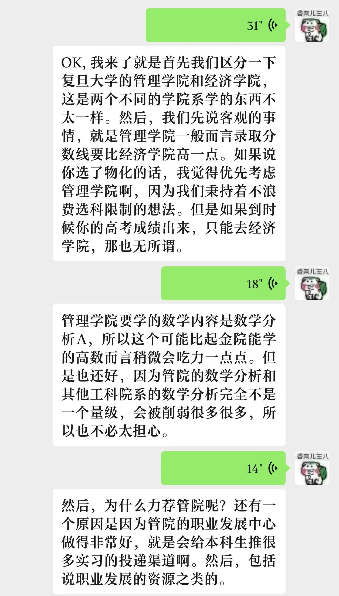

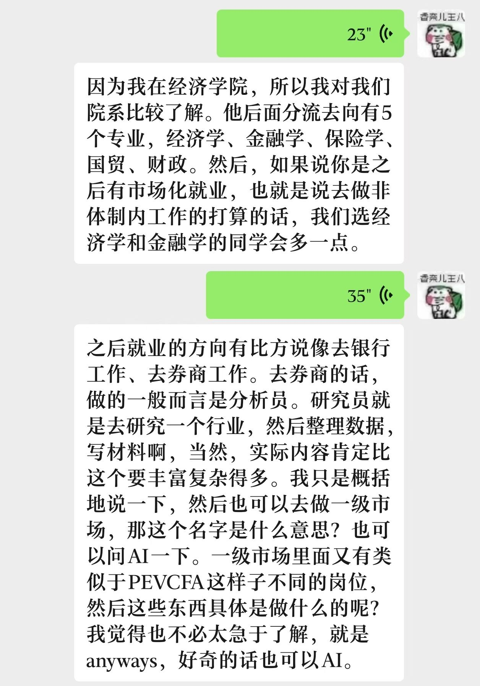

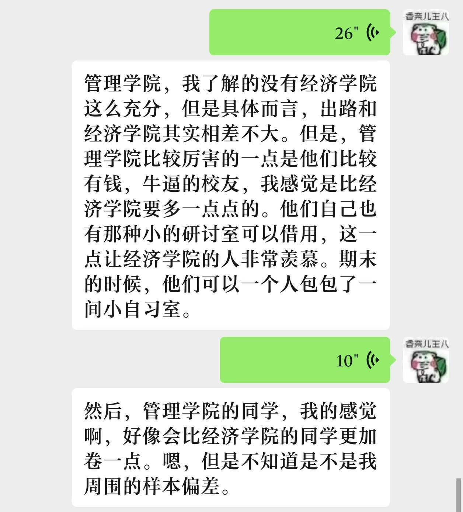

（管院同学说: 其实我很羡慕经院的新大楼【编者注：是的，我们有一栋很新很大的楼，里面有咖啡馆以及只有经济学院同学能使用的图书馆，自习环境远胜过本部的理科图书馆】，以及我感觉时我周围的样本偏差，经院的同学也好卷qwq）

### 工科试验班（集成电路领军人才班）和工科试验班（集成电路与微纳电子创新学院）主要区别是什么？

这是一个典型问题。所有的领军人才班和非领军人才班的区别都是类似的。可参考上面未来信息学院的相关信息。简而言之，领军人才班在绩点并不低的离谱/排位并不倒数 且完成一些要求(学术相关)的前提下，可以直博/保研本校(具体政策依然更新中，我们本专业学生也并不清楚)。而非领军人才班就需要努力卷卷绩点，争取保研名额【被稀释】，不行的话就努力考研。但领军班如果你到了大三不想放弃沉没成本，就相当于被捆绑在本校了。当然届时你可以选择退出，但更建议报考前就想想清楚。如果未来想出国，那么没必要报领军。

关于微电子专业普通班的具体情况，建议1对1找学长学姐细问【渠道：年级大群/找班主任问联系方式】。文档里叙述并不那么方便。

### 复旦大学新工科到底水平怎么样？为什么要到复旦读工科？

（来自机器人专业的同学）我说一下当年我选择的时候，为什么读工科还来到复旦的原因：

**1）****学科优势**

我现在读的智能科学与技术专业确实是一个比较新兴、比较前沿的学科。我相信复旦工科一定会慢慢的越来越好的，可能不会在短时间内追上并且超越那些传统工科强校，因为他们有百年来的积累，这样的一个鸿沟还是很难跨越的。但是我相信学院和学校的工科发展会越越来越好的，因为工科它其实就是以理科为基础嘛，那么复旦的数学和物理是全国顶尖的，在这样的一个基础加成下，复旦还在把大量的资源投入到工科的建设发展当中，所以我觉得它的发展未来一定不会差。

**2）****地域优势**

因为我们学院地处上海，首先在一个地域问题上面，它就是非常占优势的，能跟很多的前沿的企业去进行接轨。

我们学院就和宇树科技、上海人形机器人有限公司、捷卡公司、欧普照明等有校企联合的这样的机构，大概是去年刚创立的时候谈了10所，今年又好像谈了10多所，综合总结下来大概是有20到30所校企联合中心，是目前复旦来说就是校企联合中心承办最多的几个学院之一。

**3）****资源与视野**

复旦能给你的一些资源和视野是很多的。相比传统的工科院校，我就以上交大举例吧，（因为可能在报考的时候还是会跟上交大对比选择）。我当年为什么选择复旦，而没选择上交大，就是因为：交大它工科特别强，必须承认，它有百年来的这样一个工科的历史积累，但是可能因为它的工科是在闵行校区，然后它的其他的学科可能在徐汇呀、或者分布在各个校区。但是复旦它的所有的学科，在本科阶段都是在邯郸校区的【编者注：其实法学在大二会去江湾校区，医学院所有同学大二会去枫林校区。张江校区疑似是微电子要去？我不确定】，所以你在复旦的时候更容易，也更方便去接触到各色各样的，来自不同专业的同学，然后能你们的思维能进行很多碰撞，能提高你的很多眼界激发你的灵感，那么在这样的过程当中，对人的综合全面发展是很有帮助的。

以及作为综合类的院校，复旦的人文关怀是很浓的。在复旦，就这一年我的个人学习体会来说，我非常喜欢这样的一个开放、包容、自由【编者注：选课自由（这使你可以DIY自己的培养方案，一个专业的同学不一定上同一堂课）、出入校自由等等】的这样一个氛围。当然我没去过交大读书，所以也不知道那边的具体情况，只是从印象中的总结。

### 什么是本博融通？

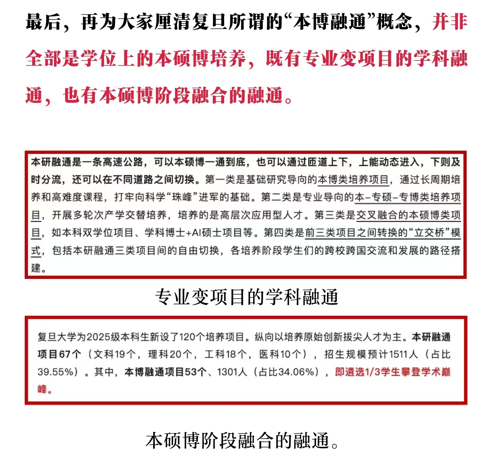

（摘录自大数据同学的介绍）本博融通的政策，顾名思义即八年本博连读，在本科三年级与五年级阶段存在转段考核，本科三年级通过考核即可攻读研究生（即本校保研），理论上转段考核是基于你的科研经历，绩点的综合考核，但实际上只要绩点达到3.3（一个相对较低的标准）+一次fdurop（学生科研）即可，而在五年级的转段考核可以选择中途退出计划，即只读完硕士学完，换而言之，此计划可以理解为本硕连读或本博连读任君挑选。
